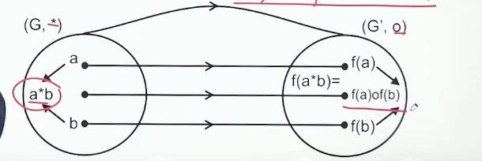
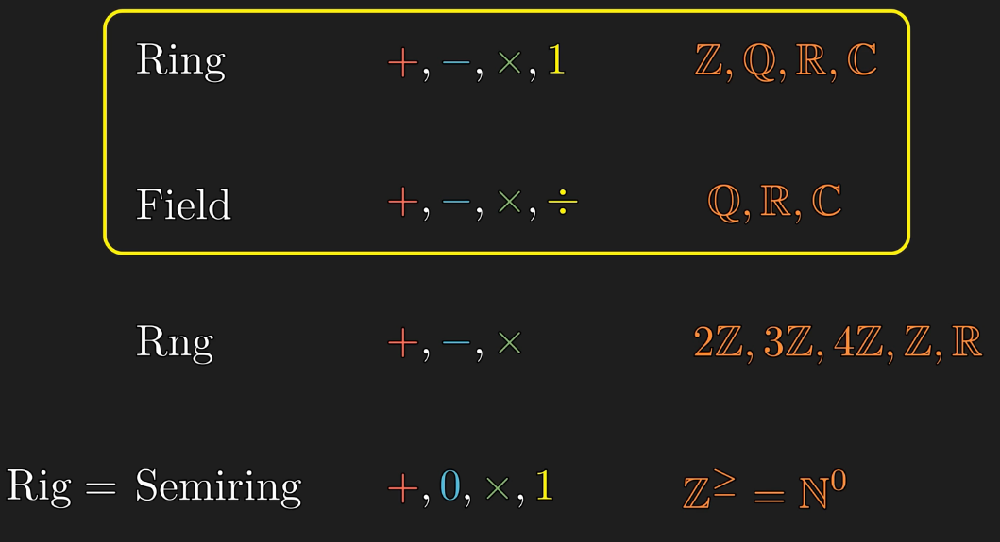

### Normal Subgroup (H $\triangleleft$ G)
	- aka Special/Invarient/self conjugate subgroup
	- $xhx^{-1} \in H$
	- Subgroup's Left Coset = Right Coset [aH = Ha] (always true for _abelian_ group G and hence for _cyclic_ group)
	- Improper normal subgroup - Group G and {e}, rest are proper
	- Simple Subgroup: No proper normal subgroup
		- Group of prime order has only subgroup of order 1 and group itself, because subgroup order is a divisor of group! [Lagrange's theorem]
	- Hamiltonian Subgroup: If all subgroup of a non-abelian group is normal subgroup
	- $HaHb = Hab$ and $aHbH = abH$, if H is normal subgroup
	- Index of subgroup = No. of distinct left(right) cosets = o(G)/o(H)
- ### Quotient Group (G/H)
	- G/H is quotient group if H $\triangleleft$ G and HaHb = Hab, where Ha, Hb \in G/H
	- Set of all different unique cosets of normal subgroup H
		- Composition Table: Table against cosets of H (HaHb = Hab)
	- Element of Quotient Group is of type Kx (or xK)
	- If G is abelian(cyclic), then G/H is also abelian(cyclic). Converse is not true.
		- $S_3 / A_3$ is cyclic but $S_3$ is not cyclic
- ### Homomorphism (f: G \rightarrow G')
	- Iff f(a*b) = f(a) o f(b)
		- 
	- Types
		- Monomorphism : Homomorphism + Injection
		- Epimorphism : Homomorphism + Surjection
			- f(G) = G' OR pre-image of G' exists
		- Isomorphism : Homomorphism + Bijection
		- Endomorphism : Homomorphism if G = G' (same group)
		- Automorphism : Homomorphism + Bijection if G = G' (same group)
	- Theorem
		- f(e) = e' (e & e' be respective identities of G and G')
		- $f(a^{-1}) = [f(a)]^{-1}$
		- $f(a^n) = [f(a)]^n$, n \in Z and a \in G
		- H \in G is a subgroup implies f(H) \in G' is also a subgroup.
		- H' \in G' is a subgroup implies $f^{-1}(H')$ is a subgroup of G
		- f(G) is a subgroup of G'
		- For cyclic group G
			- (G, ·) \cong (Z, +) iff G is infinite
			- (G, ·) \cong ($Z_n$ , +) iff G is finite and |G| = n.
	- Kernel of Homomorphism = Ker(f) = {x \in G | f(x) = e' }
	- Theorem of Homomorphism
		- $K \triangleleft G$ if K is kernel of f: G \rightarrow G'
		- Every homomorphic image of cyclic group is cyclic, but converse is not true
			- f(G) = [f(a)]
		- Every group is homomorphic to its quotient group
			- p: G \rightarrow G/N (N=Normal subgroup) is an epimorphism for p(x) = Nx
			- _Col_: If p is homomorphism of G onto G/N, then Kernel of p = N
		- Every homomorphic image of a group G is isomorphic to some quotient group of G
			- ab^{-1} \in H $\Leftrightarrow$ Ha = Hb
- ### Isomorphism
	- Homomorphism + Bijection
	- Isomerphic Group : G \cong G'
	- Proving Isomerphism by Caley's table, replace x by f(x) for G we get equals to G' caley table.
	- Theorem
		- A homomorphism f defined from a group G onto G' is an isomorphism iff Ker (f) ={e}
		- The relation of isomorphism \cong in the set of all groups is equivalence relation.
			- i.e. G \cong G and G \cong G' $\Longrightarrow$ G' \cong G
			- G \cong G' and G' \cong G'' $\Longrightarrow$ g \cong G''
		- _Caley's Theorem_ : Every group is isomorphic to some permutation group G \cong $P_A$
		- Every infinite cyclic group is isomorphic to $(Z, +)$
		- _First Isomorphism Theorem_ :  The quotient group G/K is isomorphic to image of f = f (G) (⊂ G') under the following map
			- f  ̃ : G/K → G' defined by f  ̃ (xK) = f (x)
		- _Second Isomorphism Theorem_ : Let (G, ·) be a group and H & K ≤ G of which K $$\triangleleft$$ G. Then,
			- H.K ≤ G
			- H ∩ K $$\triangleleft$$ H.
			- H.K/K \cong H/H ∩ K
		- _Third Isomorphism Theorem_ : If H, K $$\triangleleft$$ G and K \subset H, then
			- H/K $$\triangleleft$$ G/K
			- G/H $$\cong$$ (G/K) / (H/K)
- ### Automorphism
	- Homomorphism + Bijection if G = G' (same group)
	- $A_G$ or Aut(G)
	- The set $$A_G$$ of all automorphism of the group
- ## Ring Theory
	- ### Rings
		- {:height 232, :width 404}
		- Z adj i = Z[i] = {a + i b : a,b \in Z}
		- Zero divisors : xy = 0 => x can be a zero divisor (can be 0 or not)
			- 5 $$*_{10}$$ 2 = 0 => 5 & 2 are both zero divisor (found in $$Z_n$$ where n is not prime)
		- Ring (R, +, *) is ring if (R, +) is abelian and (R, *) is semigroup(associative) and distributive(*) over (+).
		- Boolean Ring : If all element a = a^2 (idempotent)
		- Theorem
			- Ring with no zero divisor iff cancellation law holds
				- Commutative Ring with unity is Integral Domain
		- Characteristic : Smallest number m such that m.a = 0 \forall a \in R
			- If no such exists, then characteristic zero
	- ### Integral Domain
		- Commutative Ring with unity and without zero divisor
		- $(Z_p, +_p, *_p)$ is integral domain iff p is prime
		- Finite integral domain is field.
		- Characteristic(integral domain & field) : Smallest number m such that m.e = 0
			- Field/Integral Domain characteristic is either 0 or prime.
	- ### Division Ring
		- if its non-zero elements form a group under multiplication.
		- Ring with unity and non-zero element has its multiplicative inverse
- ## Field
	- Commutative Division Ring
	- (F,+,*) => (F,+) & (F/{0}, *) is abelian and follow distributive law
	- ### Unit element
		- b | ab = e* = ba
		- (Z,+,x) has {1,-1}
		- Set of all unit group in a ring with unity forms a multiplicative group
- ### Subring
	- Non void S is subring of R iff a, b \in S => (a-b), ab \in S
	- Intersection of two subring is also a subring