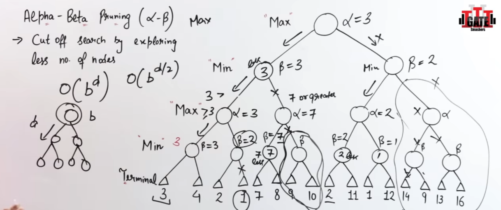

- {:height 186, :width 536}
- {:height 261, :width 470}
- ### BFS
	- Uninformed, Complete(searches all even in infinite)
	- Uses FIFO (Queue) to traverse
	- O(V+E) O($b^d$)
	- Optimal (cost is min)
- ### DFS
	- Incomplete (infinite/cycle)
	- Stack (LIFO)
	- Non-optimal (cost may not be min)
	- O(V+E) O($b^d$)
- ### Bidirectional Search
	- {:height 265, :width 469}
- ### 8 bit Puzzle
	- {:height 274, :width 436}
	- #### Heuristic(Informed Search)
		- No. of misplaced tiles
- ### Heuristic
	- Use euclidean, manhattan(|x1-x2| + |y1-y2|), misplaced tiles in 8 bit puzzle
	- Good solution, reduce time complexity, not always optimal
- ### Generate and test
	- Heuristic, DFS with backtracking
	- Good generator: Complete, Non-redundant, Informed Search
	- Generate all state with heuristics and remove state which aren't the solutions
- ### Best First Search
	- {:height 361, :width 588}
	- f-values are not related to cost, but heuristics
	- sort after each insertion in queue
- ### Beam Search Algorithm
	- Care of space complexity by only account for best $\beta$ (beam width) branch node, instead of all
	- Not complete
- ### Hill Climbing Algo
	- $\beta$ = 1
	- {:height 336, :width 565}
- ### A* algorithm
	- {:height 269, :width 520}
	- {:height 306, :width 594}
- ### AO*
	- Update heuristic values based on lower values and update it till root level
	- f(n) is for current node, not path when updating values
	- {:height 403, :width 403}
	- It doesn't explore all solution path once it got the solution
- ### Minimax Algorithm
	- {:height 308, :width 615}
	- {:height 387, :width 453}
- ### Alpha beta pruning
	- {:height 243, :width 551}
- ### Knowledge Representation
	- {:height 291, :width 453}
	- 
- ### AI Agents
	- {:height 372, :width 659}
		- P: Performance measure
		- E: Environment
		- A: Actuators
		- S: Sensors
	- {:height 315, :width 527}
	- {:height 342, :width 576}
	- {:height 303, :width 542}
	- {:height 318, :width 559}