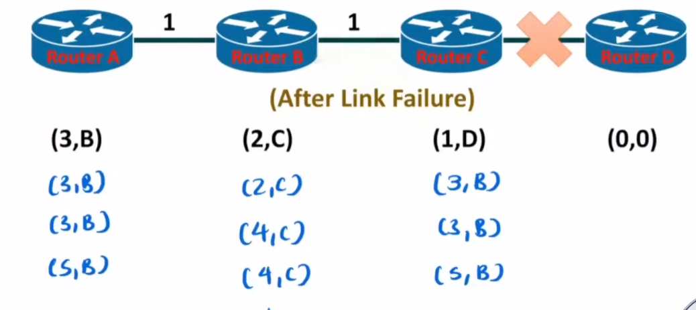
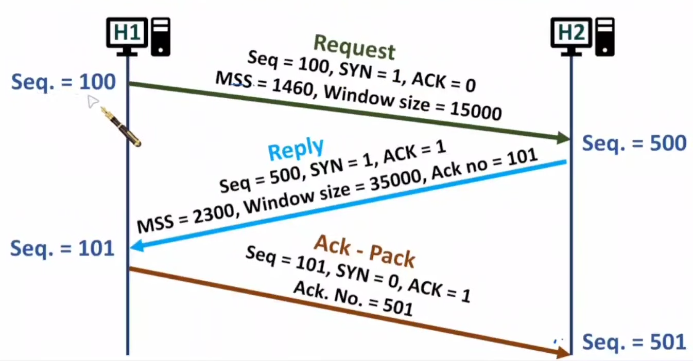

# Network Layer
	- Frame > Packets(Network Layer) > Segments
	- Tasks
		- Logical Addressing
		- Subnetting & Supernetting
			- _Subnetting_ : Large Network into small network & opposite for _supernetting_
		- Routing : Path Determination
		- Fragmentation
			- Restructure of frame formation due to varying data frame length as defined by various LAN like WLAN(2301), Ethernet(1500 bytes), Token Ring LAN(4500 bytes) etc
	- MAC (48 bits)
	- {:height 345, :width 620}
		- Network ID can't be all 0 or all 1(s) _only_ for Class A
		- |Class|MSB|
		  |--|--|
		  |A|1 to 127|
		  |B|128 to 191|
		  |C|192 to 223|
		  |D|224 to 239|
		  |E|240 to 255|
		- Network IP : For Class A, B, C Host ID octaves must be 0, other can be anything. (eg: 91.0.0.0 for class A)
			- Subnet Network IP = Lowest IP of subnet
		- Direct Broadcast IP : Similar to Network but instead of 0, there is 1. (eg: 91.255.255.255 for class A) i.e, all host IDs are 1s.
			- Subnet Direct Broadcast IP = Highest IP of subnet
		- No. of Host = 2^n - 2 (One for Network IP & other for broadcast IP)
			- No. of IP = 2^n
			- No. of Networks = 2^(32-n)
		- Unicasting : One to one message forwarding
		- Broadcasting
			- Limited Broadcast : Using 255.255.255.255 limited to the same network in the router
			- Direct Broadcast : Using _Broadcast IP_ of that router/network
			- In a network, at Data Link Layer, router will broadcast with MAC address FF:FF:FF:FF:FF:FF automatically.
		- If the frame comes from the external router, then it is treated as Network IP instead of Subnet Network IP, however if it comes from internal router, then it is treated as Subnet Network IP
	- ## Subnetting
		- Introduction of Subnet ID between Network ID and Host ID at expense of previous Host ID space
		- Subnet Mask = No. of MSB bits to be checked at the router. Represented by _/x_
		- Subnet IP : All 1's for Network and Subnet ID and all 0s for Host ID
			- eg : 255.255.192.0
				- 11111111.11111111.11000000.00000000 = _/18_ (18 bits are 1, are masked)
				- 16 bit for Network ID; 2 bit for Subnet ID; remaining for host ID
				- _Subnet of 255.255.255.0 is also valid for that as it falls under subset of the above subnet filter._
			- Routing is done using Logical _AND_ with Subnet IP and the destination IP to make routing decisions. Logical AND gives the network IP.
		- *No. of Subnet* = $2^{No.\ of\ subnet\ bits}-2$ {2 for network and broadcast IP of entire network}
		- Hierarchical Subnetting : Use of more subnet ID from host ID to go further levels.
		- For subnet with different IP sizes, we can use subnet mask of varying size to accommodate all.
		- In Subnetting Routing decisions are made using subnet mask IP, in case of ambiguity IP range is used(if two subnets have same subnet mask)
		- Number of hosts in each subnet = 2^no. of host bits - 2
	- ## Classless Intern-Domain Routing
		- 
			- n = no. of bits for block/mask
		- 
		- In CIDR, Network IP & Broadcast IP is suffixed by /n also.
		- First IP & Last IP = IP after Network & before Broadcast IP.
	- ## Supernetting
		- Combining small network into large. Minimizes no. of entry in external router.
		- Supernet Mask = 1s where value doesn't change & 0 for changing values
		- 
- # IPv4
	- 
		- Till destination address, there is header of mandatory 20 bytes
		- Version = 4 or 6
		- Internet Header Length(IHL)
			- Header Length = 4 * IHL (min=5, max=15(all 1s))
		- Header length must be multiple of 4, else add remaining as padding
		- Differentiated Services Code Point (DSCP) : For priority routing (default 0)
		- Explicit Congestion Notification (ECN) : Used for network congestion notification
		- Total Length (of packet): Max size = 2^16-1
		- Time to live = Decrementing Hop Count (avoid infinite loop; max 255)
		- Protocol : Protocol of data at Transport Layer
		- Header Checksum : Put checksum = 0 and compute checksum using CRC. Route recompute header checksum at each hop, due to changing fields like ECN, Time of Live etc
		- Options: Used by ISP & Network Manager. Used for recording Route(max 9 IPs; 2 byte reserved) & Source Routing (Strict Routing(Complete route path given)/Loose Routing(initial paths given))
		- Identification : Unique ID of datagram
		- Flag
			- 1st bit 0
			- 2nd bit : 1 if fragmentation is not allowed
			- 3rd bit : 1 if more fragments to follow
		- Fragment Offset : Offset of fragment in kilo byte (first byte in fragment)
	- ## Network Fragmentation
		- MTU {Maximum Transmission Unit}
		- New Payload must take in account of header length of 20 bytes, plus it must be divisible by 8. So, as to ensure offset in whole number.
		- Fragment offset = Payload first byte/8
		- Data  = IP Packet Size - Header Size
	- Localhost/Loopback : Send packet to itself (127.0.0.1)
	- ### ARP (Address Resolution Protocol)
		- Map IPv4 to MAC
		- ARP Cache
		- ARP Request > ARP reply
	- ### RARP (Reverse Address Resolution Protocol)
		- Map MAC to IPv4
		- Function at Network Layer
		- To assign IP address for unassigned
		- Susceptible to spoofing, no authentication, security and requires a dedicated RARP server.
	- ### BOOTP (Bootstrap Protocol)
		- Function at Transport Layer
		- Map MAC to IPv4
		- Use of Relay agents that relay request to BOOTP server in another network and serve the response.
		- Now, not all network requires BOOTP server.
		- Uses static IP assignment, so even if user stop using a device then also IP is occupied.
	- ### DHCP (Dynamic Host Configuration Protocol)
		- Static IP for always ON host
		- Dynamic IP for temporary hosts using lease time.
		- Supports relay servers.
		- DHCP Request and ACK
		- {:height 214, :width 210}
	- ### ICMP (Internet Control Message Protocol)
		- Implemented on top of IP
		- Used for error reporting, realibility
		- If a packet is dropped, then router will send ICMP frame to sender which indicates the reason for frame drop.
		- 
		- 
			- Type & Code will tell us about type of error type
		- 
		- Errors
			- Destination Address Unavailable
				- Network, Host, Port Unavailable
			- Source Quench : Too congestion/traffic
			- Time exceeded (TTL = 0)
			- Parameter Error : Bad IP header (checksum, length, option issues)
			- Router advertisement : Send default router address to the host
			- Router solicitation : Request for best possible router for host
			- Request (8 0) & Reply (0 0) {Type Code}
		- traceroute : Send frames with incremental TTL so ICMP Time exceeded and at end Port Unavailable error is send telling the route.
	- ### Routing
		- Mask, Network IP, Interface
		- Dynamic Routing Parameters : Traffic, Topology(If change in topology), Network Issues
		- Routing Algorithms
			- Non Adaptive/Static Routing
				- Flooding : Flood to all neighboring routers. No need for routing table. Max Network Congestion. Guaranteed Shortest Path. Used in high priority/natural disaster.
				- Random Walk : Next Path randomly; Based on weights, priority, time delays; Not used
			- Adaptive/Dynamic Routing
				- #### Distance Vector
					- Routing Information Protocol (RIP), packet sent using UDP
					- Bellman-Ford Algorithm : _Subpath of the shortest path are the shortest subpaths_
					- Based on distance metric. Updation based on iterations (= No. of Nodes - 1)
					- Count to Infinity Problem : Solved by Split Horizon
						- 
						- 
					- Applicable only to limited sized networks
					- 
					-
					- {{video https://youtu.be/p5XXN1wCm_c?si=5OH-cGRZ6S6fzQNt}}
				- #### Link State
					- Open Shortest Path First (OSPF)
					- Hello packets for neighboring router for distance determination
					- Router share link status using flooding link state packets.
					- Shortest path using Dijikstra's Algorithm
					- TTL is to avoid infinite loop.
					- Age is to avoid issue of network updation in cases of router failure/restart.
					- {:height 261, :width 209}
					- Sequence No. is added and state packets are broadcasted, sequence no ensure no flooding and to discard older packets.
	- ## IPv6
		- 128 bits
		- 
		- fe80::5671:fa9f:863d:603f%18
			- fe80 : Prefix
			- 5671:fa9f:863d:603f : Interface Identifier
			- %18 : Zone identifier or Interface index
		- 
			- 40 bytes header mandatory | Extension header (8 bytes, optional)
			- Traffic Class same as type of service in IPv4 (Priority & congestion notification)
			- Flow Label = if packet belong to same flow/stream (TCP)
			- Payload length = Extension Header + Data
				- If payload > 65535, then payload length = next header = 0, then Jumbo Payload extension header is activated
			- Next Header : Transport Layer protocol / Extension header info
			- Hop Limit = TTL
			- {:height 280, :width 450}
			-
- # Transport Layer
	- 
	- Form Segments (small) from Data (large)
	- Functions
		- Segmentation
		- Flow Control (Controlling bitrate of data based on bandwidth constraint of latter device)
		- Error Control (ARQ)
		- Process to Process communication
	- ## TCP
		- Full duplex mode (dual channel communication)
		- Buffers are allocated at sender and receiver using Window SIze (buffer size)
		- Seq = Current seq no. of sender
		- ### Initiating Connection
			- Minimum of MSS(Maximum Segment Size) of both will be selected. Same for Window Size.
			- {:height 245, :width 370}
			- On sending a SYN or FIN packet, the sequence number is incremented by *1*.
			- On sending a ACK packet, the sequence number is incremented by *size of bytes sent*.
			- Acknowledgement No. : What packet to expect next
		- ### Data Transfer
			- Piggy back ACK : ACK with data packets
			- SYN = 0 and ACK = 1 in during data transfer
			- 
		- ### Terminating Connection
			- Min 3 and max 4 packet are required
			- FIN bit = 1 & ACK = 1
		- 
			- Length = 4 * Data offset
			- Min length = 20B to 60B
			- MSS(Maximum Segment Size) is stored in options
	- ## UDP (User Datagram Protocol)
		- Speed over reliability.
		- Preferred for unreliable Multicasting & Broadcasting.
		- 
		- Port
			- 0 to 2^16 -1
			- 0 to 1023 preassigned by IANA
			- 1024 to 49151 reserved for future
			- 49152 to 65535 for private use
			- SMTP (25), FTP(21), TELNET(23)
		- Max Length = 2^16 - 1
		- Header = 8 bytes & Data 64KB - 8B
		- Checksum (CRC) = Disabled by all 1s
	-