### Brehemsem's Line Drawing Algorithm
	- 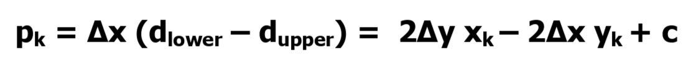{:height 81, :width 756}
	- 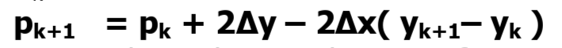
	- 
	- 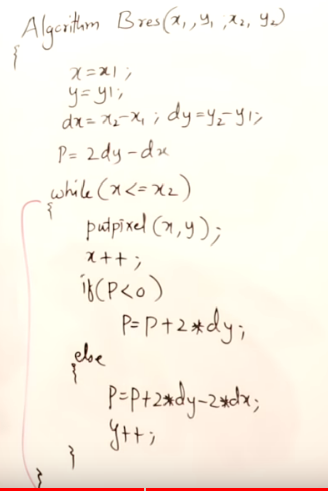{:height 435, :width 284}
	- 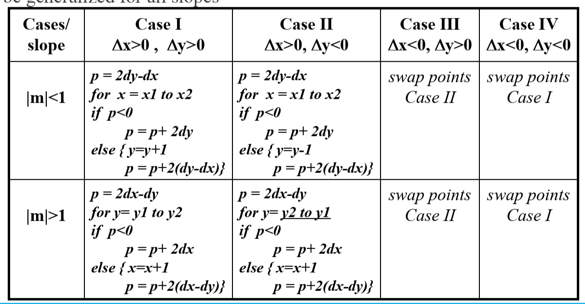{:height 405, :width 764}
- ### Midpoint circle
	- If pk < 0 => yk else yk-1
	- 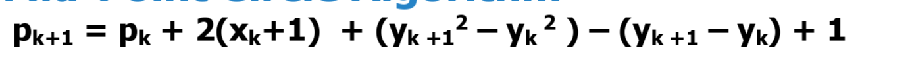
	- 
	- repeat till x >= y
- ### Ellipse
	- 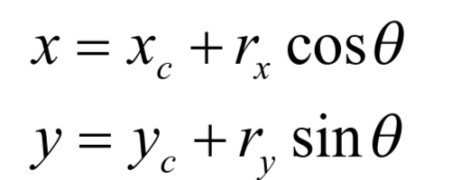{:height 119, :width 278}
	- 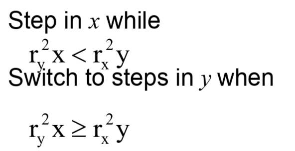{:height 184, :width 328}
		- rx ry is a & b respectively
	- 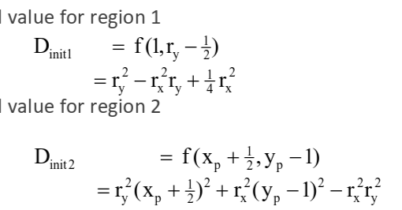{:height 181, :width 337}
	- D < 0 => yp else yp-1
	- 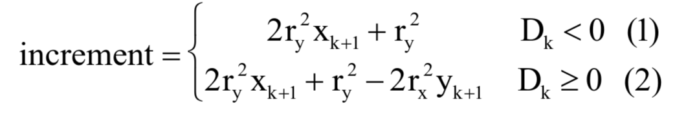
	- 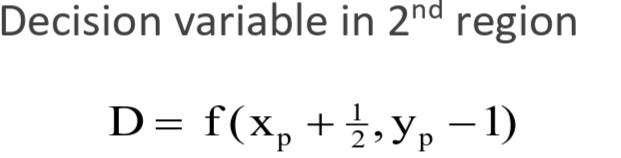
	- 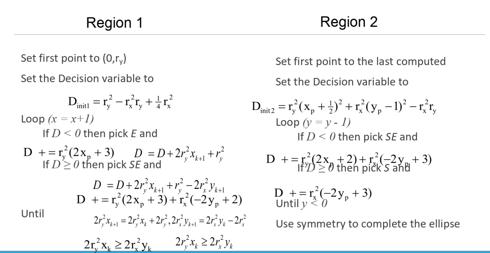
- ### Polygon
	- The point is considered to be **interior** if the number of intersections between the line and the polygon edges is **odd**
	- #### Scan fill -> fill between intersection
		- 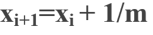
			- yi+1 = yi + 1
		- 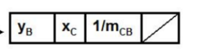
	- #### Boundary fill
		- fill till boundary
		- 4 connected or 8 connected is stored in stack and popped and filled
	- #### Flood fill
		- keep neighbour span tip on stack instead of connected
- ### Beizer Curve
	- 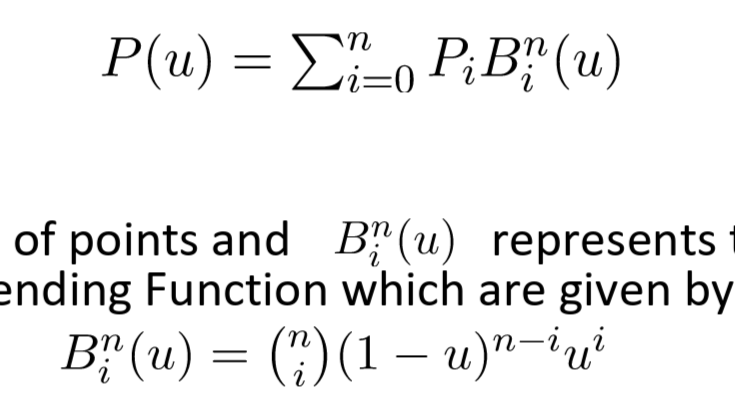
	-