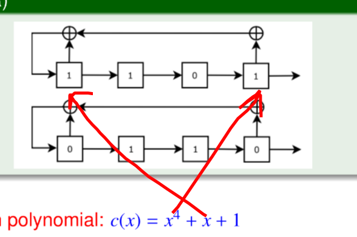

## Introduction
	- Cryptography - Achieve PAIN (Privacy & Confidential, Auth, Integrity, Non reputation[Proof of Action])
	- Cryptoanalysis - Defeat PAIN
	- #### Symbols
		- Plain Text P over alphabet \Sigma
		- Cipher Text C over alphabet \Delta
		- Key space = K
		- $w = d_k(e_k(w))$, w is plain text, k is key, d/e are decryption/encryption functions
		- cryptosystem is a five-tuple (P, C, K, E, D)
		- if $$e_k=d_k$$, then k is *involuntary key*.
	- Avalanche effect: Small change in input, should cause large unpredictable change in output
	- The cryptosystem should *not be closed under composition*
	- Asymmetric key => Use public key to encrypt and private key to decrypt;
		- Slower than symmetric encryption, because $$k = b^x mod\ m$$ (or y) is shared, and encryption key is $k=b^x.b^y\ mod\ m$ which has to be calculated!
	- Symmetric key => Most secure and performant, but key exchange is problematic.
- ## Classical ciphers
	- ### Transposition Cipher
		- #### Columnar: Type in rows(exclude space), read in columns separated by space
			- Complete: Left spaces are replaced with 'z'
			  logseq.order-list-type:: number
			- Incomplete
			  logseq.order-list-type:: number
			- Distance between two consecutive `z` may give column size.
		- #### Row: Type in column, read in rows
		- #### Keyword Column Transposition: Like columnar but uses a key, and reads in map of alphabetical order of letter of keys!
	- ### Shift Cipher
		- #### Caesar cipher (Shift $\le$ 13; ROT13 => Shift by 13)
		- #### Affine cipher
			- $c_i ≡ (ap_i + b) mod\ 26$
			- character A=0, Z=25
			- Key space = 26φ(26)
		- #### Mono-alphabetic cipher: map each character to something else
			- Frequency analysis attacks
			- Homophone cipher: Replace each letter with variety of substitute dependent on frequency!
			  logseq.order-list-type:: number
			- Polygraphic Cipher: Substitution of a group of characters
			  logseq.order-list-type:: number
				- ##### Playfair cipher
				  logseq.order-list-type:: number
					- Take key, enter non-repeated letter in 5x5 box, fill remaining with increasing order of alphabet that haven't occurred before!
					- *I & J in same block*
					- {:height 174, :width 320}
					- Cipher is next in same row
			- Poly-alphabetic Cipher
			  logseq.order-list-type:: number
				- Vigenére Cipher
				  logseq.order-list-type:: number
					- $K = (k_0, k_1, ... , k_{n−1}) ,\ where\ each\ k_i ∈ \{0, 1, · · · , 25\}$
					- $C_i ≡ (P_i + k_{i\ mod\ n}) mod\ 26$
					- {:height 169, :width 321}
					- Kasiski Test: GCD of separation between two identical segments in cipher gives us the possible length of cipher.
					- Index of Coincidence: probability that two randomly selected letters in the ciphertext represent the same plaintext symbol
						- {:height 96, :width 298}
						- 0.03846 ≤ I ≤ 0.065
				- Hill cipher
				  logseq.order-list-type:: number
					- 
	- ### Codebook Cipher
		- A book with mapping of plain segment to cipher and vice-versa. The longer the block more immune to frequency analysis!
		- #### Block Cipher
			- $T[X] = f_{key}(X)$ T is Table, and X is block
	- ### One time pad
		- Encryption: Plaintext ⊕ Key = Ciphertext
		- Key length = Length of plain text
	- ### Engima (Machine cipher)
		- Poly alphabetic substitution cipher, but with each letter typed permutation changes
- ## Shannon's Theory and Perfect Secrecy
	- For a system to be secure, it should require at-least 2^112 ops before breaking it.
	- |Attack|Compromised|
	  |--|--|
	  |KCA/COA|number of ciphertexts polynomial in the input size|
	  |KPA|plaintext ciphertext pairs|
	  |CPA/CPA1|Cipher Text for any choosen plain text|
	  |CCA/CCA1|Plain text for any choosen cipher text|
	  |ACPA/CPA2|CPA, in which choice of plain text depend on cipher text from previous request|
	  |ACCA/CCA2|CCA, in which choice of cipher text depend on plain text from previous request|
	- Grey Box: Access to cipher implementation, Side channel attacks (fault, power etc)
	- White Box: Open devices
	- ### Perfect Secrecy
		- #### Introduction
			- Probability of C given K & P
			- 
			- 
			- 
			- K and P are independent
		- Perfect secrecy or Shannon-secure: $$Pr[x|y] = Pr[x] ∀x ∈ P, y ∈ C.$$
		- or every x ∈ P and every y ∈ C, ∃ ! K : eK (x) = y.
		- Let $P = C = K = (Z_2)^n$ for n ≥ 1. For $K ∈ (Z_2)^n$ , $e_K (x) = (x_1 + K_1, . . . , x_n + K_n)$ mod 2
	- #### Self Information (less probability => more information)
		- 
	- #### Entropy (average self information)
		- 
		- ##### Theorems
			- H(X) ≤ log2 n where n=|X| & equality if when Pr[x]=1/n
			- H(X, Y) ≤ H(X) + H(Y) & equality if X, Y are independent
			- $H(X|Y) = ∑_y Pr[y].H(X|y) = − ∑_y ∑_x Pr[y]Pr[x|y] log_2 Pr[x|y]$.
			- H(X, Y) = H(Y) + H(X|Y)
			- H(X|Y) ≤ H(X) & equality if X, Y are independent
			- H(K|C) = H(K) + H(P) − H(C)
	- #### Spurious Key (false positive keys that give wrong meaning when decrypting a cipher)
	- #### Entropy of plain text
		- 
	- #### Redundancy of a Language
		- 
	- #### Unicity distance:
		- The average amount of ciphertext required for an opponent to be able to uniquely compute the key, given enough computing time
			- Spurious Key=0
- ## Block Cipher
	- $f^-1$ exists
	- 
	- n = block size, k = key size
	- subset of $2^k$ permutations among all $2^n$! permutations on n bits.
	- #### Kerckhoffs’ Principle: Only key is secret
	- ### Even-Mansour Construction
		- {:height 108, :width 316}
		- \pi is a permutation function
		- $M ∈ {0, 1}^n$
	- ### Product cipher
		- $S_1 × S_2 = (P, P, K_1 × K_2, E_1, D_1)$
		- $e_{(K_1,K_2)}(x) = e_{K_2} (e_{K_1} (x))$
	- ### Iterative Block cipher
		- {:height 181, :width 410}
	- ### Confusion / Diffusion
		- #### Confusion: Make cipher confusing from plain text (substitution/ S Box)
		- #### Diffusion: Rearrange/Spread out the bits. (bit permutation)
		- Methods
			- S-box + Permutation
			- S-box + MDS matrix
			- ARX (Mod Addition + Rotation & Xoring)
		- {:height 187, :width 333}
	- ### Padding
		- If there are x bits left, then pad message with hex(x).
		- If it is a multiple of 16 bytes, add 16 bytes 10.
	- ### Feistal Structure
		- {:height 382, :width 202}
	- ### DES
		- 64-bit block length
		  56-bit key length
		  16 rounds
		  48-bit of key used in each round
		- {:height 353, :width 319}
		- {:height 430, :width 742}
			- Left Shift is 1 for i =1, 2, 9, 16 and 2 for other rounds
		- *Appendix:* Initial & Inverse Initial Permutation
		  collapsed:: true
			- 
		- *Appendix:* Expansion & Permutation
		  collapsed:: true
			- {:height 214, :width 405}
		- S Box (101101) => First and last bit represent row, rest are column in S box
		- *Decryption*
		  collapsed:: true
			- {:height 326, :width 274}
		- 
		- Weak Key
			- DES k(DES k(m)) = m, ∀ m.
		- Semi weak key
			- DES k1 (DES k2 (m)) = m, ∀ m.
		- Weak permutation
			- y1 = Fk(x1) & y2 = Fk(x2) => k is easy to extract
		- #### DESX
			- 
			- Keys = 184 bits (approx 118 effective)
- ### AES
	- $m(x) = x^8 + x^4 + x^3 + x + 1\ or\ 11B$
	- {:height 421, :width 422}
	- {:height 148, :width 530}
	- {:height 343, :width 428}
	- Shift -> 2nd row 1 byte left circular shift and so on
	- Mix col
		- 
	- {:height 367, :width 386}
- ### Mode of Operation
	- #### Electronic Codebook (ECB)
		- {:height 224, :width 177}
	- #### Cipher Block Chaining(CBC)
		- Initialization Vector `IV`
		- {:height 217, :width 263}
	- #### Cipher Feedback (CFB)
		- {:height 224, :width 434}
		- Ek = Dk => not for public key encryption
	- #### Output Feedback (OFB)
		- {:height 246, :width 400}
		- synchronous
	- #### Counter (CTR)
		- {:height 221, :width 367}
	- ### GCM
		- $g(x) = x^128 + x^7 + x^2 + x + 1$
		- {:height 337, :width 350}
	- ### XTS-AES
		- {:height 268, :width 402}
- ## Stream Cipher
	- Synchronous: Keystream is generated independently
		- 
	- Self synchronous: Depends on previous cipher stream as well
		- 
	- Software(Profile 1) -> 128 bits / Hardware(Profile 2) -> 80 bits
	- ### Tests on PRBG
		- Poly-time statistical tests: if no poly-time algorithm can correctly distinguish between an output sequence of the generator and a TRBG of the same length with prob significantly > 1/2 .
		- Next-bit test: if there is no poly-time algo which, on input of the first l bits of an output sequence s, can predict the (l + 1)th bit of s with prob significantly > 1/2 .
		- PRBG that passes the next-bit test is called a cryptographically secure PRBG.
	- ### PRBG Generators
		- #### Linear Congruential Generator
			- $x_{n}\equiv ax_{n-1}+b\ mod\ m$
			- iff
				- gcd(b, m) = 1,
				- if p | m, then p | (a − 1) for all prime factor p of m,
				- if 4 | m, then 4 | (a − 1)
		- #### RSA CSPRBG
			- n = p.q (p, q are large primes)
			- 0 < e < φ(n) s/t gcd(e, φ(n)) = 1
			- $x_{i}\equiv x_{i-1}^e\ mod\ n$
		- #### BBS (Blum-Blum-Shub) CSPRBG
			- n=p.q (p,q ≡ 3 mod 4 and large primes)
			- take x, s/t gcd(x, n) = 1
			- $x_i ≡ x^2_{i−1} mod\ n$
			- l random bits are b1, b2, . . . , bl (bi being least significant digit of xi) [same in RSA CSPRBG]
	- ### Golomb’s Postulates
		- Gap - Run of 0s; Block - Run of 1s
		- No. of 0s and 1s differs by max 1.
		- Half runs should have length 1, 1/4 have length 2 ,1/8 have length 3 and so on
		- 
			- No. of matching bits
			- 
			- two valued at T=0 and $$T \ne 0$$
	- ### Five basic tests
		- #### Frequency Test (Monobit Test)
			- 
			- follows a χ2 distribution with 1 degree of freedom if n ≥ 10.
			- n0 = no. of 0s
		- #### Serial Test (2-bit Test)
			- 
			- follows a χ2 distribution with 2 degrees of freedom if n ≥ 21.
		- #### Poker Test
			- 
			- follows a χ2 distribution with 2^m − 1 degrees of freedom
		- #### Runs test
			- 
			- follows a χ2 distribution with 2k − 2 degrees of freedom
			- The expected number of gaps (or blocks) of length i in a random sequence of length n
				- 
		- #### Autocorrelation test
			- 
			- follows an N(0, 1) distribution if n − d ≥ 10
			- check for correlation between sequence and shifted version
	- ### Linear Feedback Shift Registers (LFSR)
		- Connection polynomial
			- 
		- {:height 360, :width 536}
		- Period -> S j+N = S j (<= 2^n - 1) n = degree
		- L(s) = length of the shortest LFSR that generates s
		-