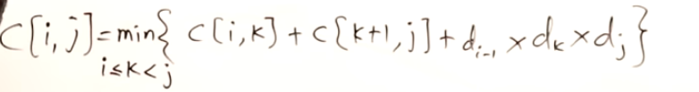
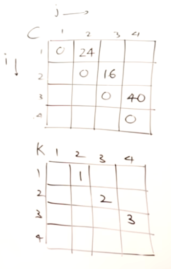
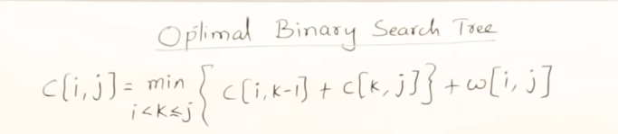
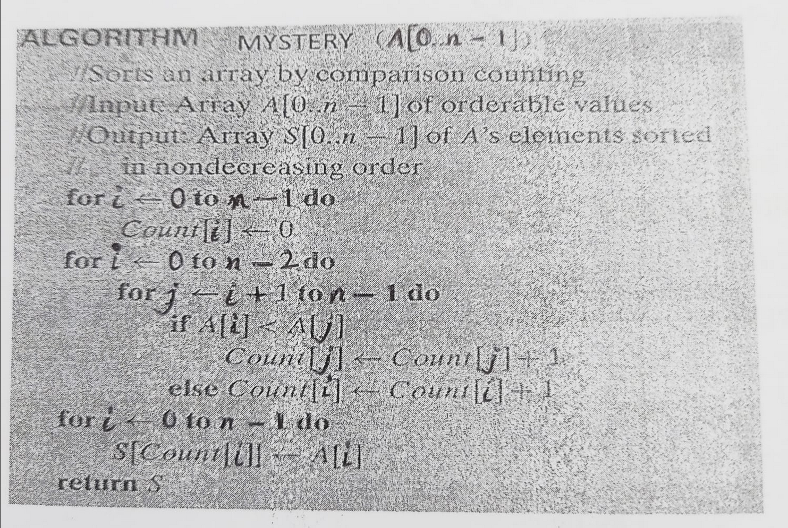

- DP
	- Memorization
	- Tabulation Iterative
	- All pair sorted
		- row column same and then find route via i
	- Matrix Chain Multiplication
		- Cost of multiplication (m,p) (p,n) = m*p*n
		- 
		- 
	- Bellman Ford (Single Source shortest path | work for negative weights too)
		- Fails in negative weight cycle
		- Relax = V-1 times and calculate wt with taking all edges
	- 
	-
- 
-