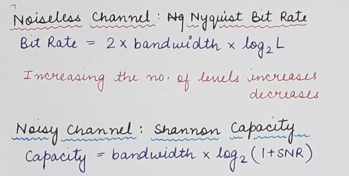
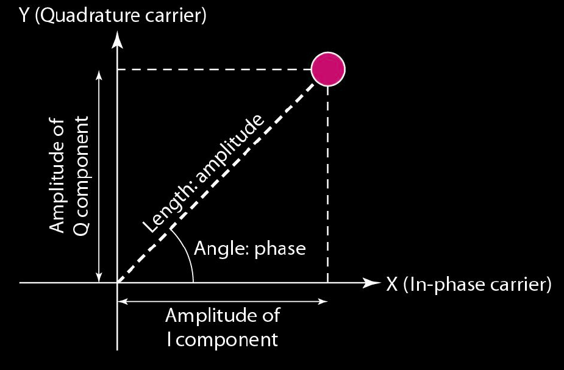
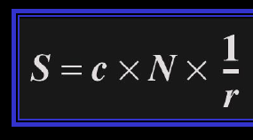
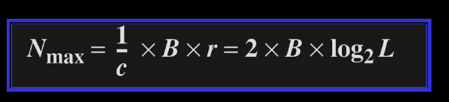
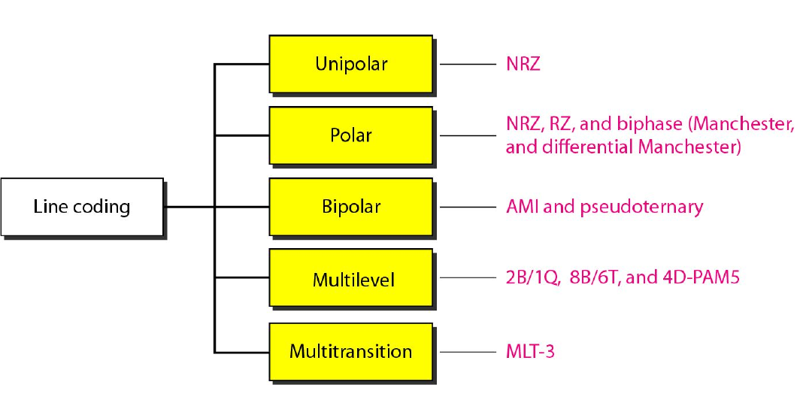
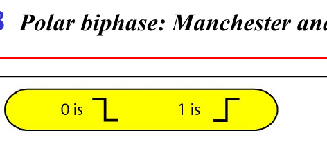
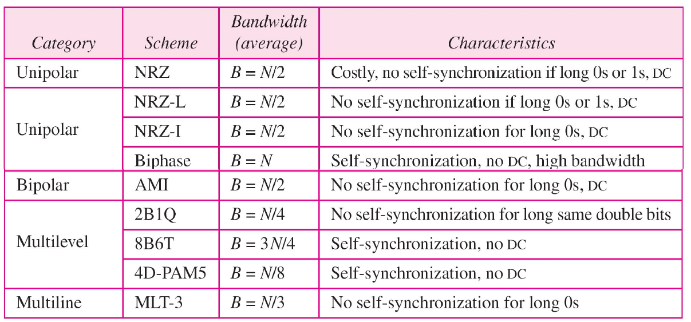

### Delta Modulation
	- Diff in Pulse 1 -> +ve, 0 -> -ve
- 
- ### Transmission
	- Parallel: All bit at once
	- Serial: Isochronous(even gap btwn frames), Sync(frames), async(start and end flag with gap)
- Digital to Analog
	- Amplitude Shift Key: 1 change, 0 no change
		- B = (1+d)S             S=Sampling Rate
	- Frequency Shift Key
		- 1 -> +ve f, 0 -> -ve freq from f_{c}
		- B = (1+d)xS +2Δf
		- B = (1+d)xS + (L-1)/2 Δf = LxS
		- Coherent = Respect phase
	- Phase Shift Key
		- B = (1+d)S
	- 
	- Baud rate = No of signal elements/sec = S = N/r (N=bitrate, r = no of data bit per segment)
- Analog to Analog
	- Amplitude, freq, phase modulation
	- B_{AM} = 2B
	- 
	- 
	- 
		- NRZ-L and NRZ-I both have an average signal rate of N/2 Bd
		- The minimum bandwidth of Manchester and differential Manchester is 2 times that of NRZ
		- 
		- 
		- mB/nB