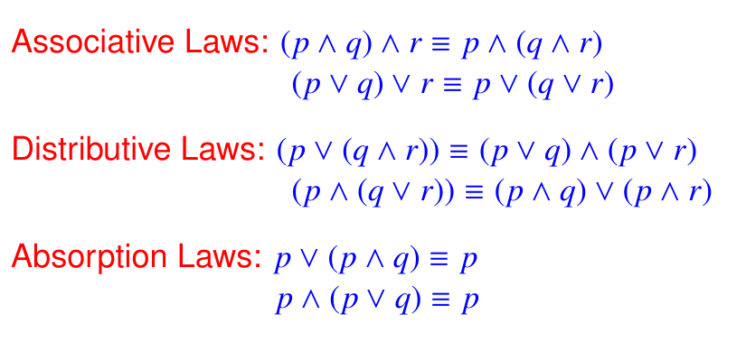

## Logic
	- Other notations for negation are p̄, ∼ p, −p, N p, $p^{'}$ or !p.
	- Incluse or : OR 
	  Exclusive or: XOR
	- For two statements S and T the following convey the same meaning:
		- If S then T .
		- T if S .
		- S implies T .
		- S only if T .
		- T is necessary for S .
		- S is sufficient for T .
	- {:height 113, :width 341}
		- The converse and the inverse of a conditional statement are equivalent.
		- p ⇒ q ⇔ ¬p ∨ q.
	- {:height 187, :width 286}
	- A contingency is a proposition which is neither a tautology nor a contradiction.
	- {:height 182, :width 328}
	- {:height 171, :width 363}
	- Lemma => Theory => Corollary
	- A conjecture is a statement that is being proposed to be true.
	- 
		- for all = for any = for every
		- there exists = for some
		- negation = universal -> existensial
	- {:height 159, :width 373}
		- Constructive proof : Proving for a arbitrary value for existential quantifier or disproof universal
		- Vacuous Proof : A always false
	- If you want to place n pigeons into m pigeonholes, and n > m, then at
	  least one pigeonhole will contain more than one pigeon.
	- If you want to place n pigeons into m pigeonholes, then one of the
	  pigeonholes will contain at least $$floor (n-1/m) + 1$$ pigeons.
- ## Set Theory
	- B \ A = {x ∈ B : x < A}.
	- A binary relation ρ from X to Y is by definition a subset of X × Y.
	- {:height 121, :width 356}
	- {:height 198, :width 430}
	- {:height 302, :width 586}
- ## Partial Order Set
	- Partial ordering : Helps in Ordering of pair in relation (Reflexive, Anti-symmetric, Transitive)
	- A set S with partial order relation R is POSET denoted by (S, R) or (S, \le) or a \le b
	- Partial means not every pair is comparable( i.e. a,b \in (S,R) if aRb or bRa, then comparable)
		- {:height 147, :width 472}
		- Does not divide symbol
			- 
		- Matrix
			- {:height 122, :width 228}
			- aRa but aRb is false
	- ### Hasse's Diagram
		- Remove Self loops, Transitive edges, all edge must point upwards, remove arrow dirn as well
		- If a chain is formed, then R is a total order or linear order, & (S,R) is total order set. [Every two element are comparable]
	- ### Type of elements
		- |Type|Definition|Is Unique (one only)|
		  |--|--|--|
		  |**Minimal element**|x is minimal element iff yRx is false for all values of y \ne x|No|
		  |**Maximal element**|x is maximal element iff xRy is false for all values of y \ne x|No|
		  |**Least element (Minimum element)**|x is least element iff \forall y \in S => xRy|Yes, if it exists|
		  |**Greatest element (Maximum element)**|x is greatest element iff \forall y \in S => yRx|Yes, if it exists|
		  |**Lower bound**|x \in S is lower bound of set T \subset S if \forall y \in T xRy|No, also need not to be \in T|
		  |**Upper bound**|x \in S is lower bound of set T \subset S if \forall y \in T yRx|No, also need not to be \in T|
		  |**Least Upper bound (LUB or supremum or join or v)**|x \in T is least upper bound of set T \subset S if \forall y \in U xRy U=Set of all upper bound for set T[:br][:br]LUB(T) = minimum {Upper Bound(T)}|No, also need not to be \in T|
		  |**Greatest Lower bound (GLB or infimum or meet or Λ)**|x \in T is greatest lower bound of set T \subset S if \forall y \in L yRx L=Set of all lower bound for set T[:br][:br]GLB(T) = maximum {Lower Bound(T)}|No, also need not to be \in T|
		- 
	- #### Not in Syllabus
	  collapsed:: true
		- {:height 154, :width 627}
		- {:height 59, :width 624}
	- ### Well-ordered set
		- Let (X, ≤) be a poset. Then X is said to be well-ordered set (and ≤ an well ordering of X) iff **each non-void subset of X** _has a least element_.
		- Any well-ordered set is a linearly ordered, converse is not true.
	- ### Partition
		- Conditions
			- $S_i \ U \ S_j \ = \ S$
			- $S_i \ne \Phi$ and $S_j \ne \Phi$
			- $S_i \cap S_j = \Phi$ or ($S_i = S_j$ and i = j)
		- Equivalence Class : [x] = {y: for all x \in X & (x, y) \in \rho}
			- Each equivalent class is either disjoint or identical
		- Remainder is always non-negative
			- Congruence Modulo a ≡ b [mod(5)] means a-b is divisible by 5
			- Since there are exactly n possible remainders 0, 1, 2, · · · , n − 1, so there are n
			  equivalence classes, viz., (0), (1), (2), · · · , (n − 1).
			- Let X be a non-void set and ρ be an equivalence relation on X. Then P(ρ) is usually denoted by X/ρ is called qutioned set of X by ρ.
	- ## Functions
		- Direct Image : Range _Set_ for A \subset Domain
		- Inverse Image : Range _Set_ of $f^{-1}$ for A \subset Range of $f$
		- Let f : X → Y be a function and let A, B ⊆ X and C, D ⊆ Y. Then
			- f (A ∪ B) = f (A) ∪ f (B)
			- f (A ∩ B) ⊆ f (A) ∩ f (B)
			- $f^{−1}$ (C ∪ D) = $f^{−1}$ (C) ∪ $f^{−1}$ (D)
			- $f^{−1}$ (C ∩ D) = $f^{−1}$ (C) ∩ $f^{−1}$ (D)
			- $f^{−1}$ (Y \ D) = X \ $f^{−1}$ (D)
		- One one injective, onto surjective
			- A function f : X → Y is said to be onto or surjective iff f (X) = Y, i.e., iff for each y ∈ Y ∃ x ∈ X s/t f (x) = y.
			- Let f : X → Y and g : Y → Z be functions, then
				- g ◦ f is injective if f, g are injective
				- g ◦ f is surjective if g, f are surjective
				- g ◦ f is bijective if g, f are bijective
				- if f : X → Y be bijective, then f −1 : Y → X is bijective.
		- ### Choice functions
			- {:height 282, :width 461}
			- Let X be a non-void set and let T = P(X) \ φ be the collection of all non-void subset of X. Then a choice function on X is a function c : T → X s/t for each A ∈ T, c(A) ∈ A.
			- Axiom of Choice: Every non-void set X admits a choice function.
- ## Countability
	- Finite set : S (n(S) = n) is finite iff there is a bijection from {0, 1, ... n-1} to S.
	- Infinite Set: S is infinite, if $f:S\rightarrow S$ implies f is injective and Range \ne Co-domain (one one and into)
		- Countable Set: Set which is finite or has cardinality same as set of positive integers, can be shown as _sequence (ordered list)_
		- Countably Infinite Set using Bijection (|A| = |B|)
		- S is countably infinite iff $$f:N \rightarrow S$$ **is a bijection**.
		- 
		-
-