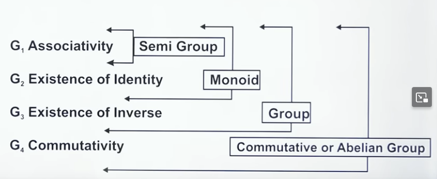
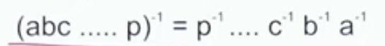
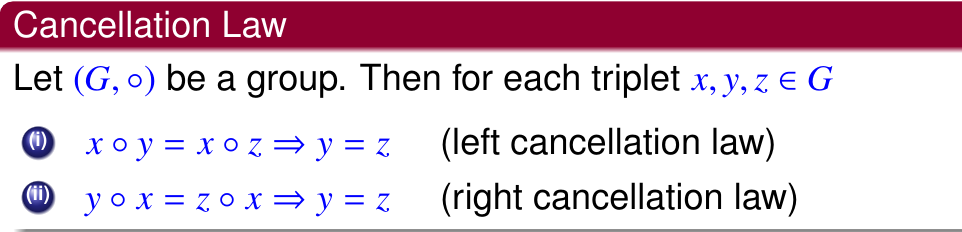

- Groups
	- Quasi Group or Groupoid or Magma follows Closure a . b = c
	- Semi-group follows Associative a . (b . c) = (a . b) . c
	- Monoid follows Neutral/Identity a.e = e.a = a
	- Inverse = a $a^{-1}$ = e
- Abelian Group
	- Group that is commutative a . b = b . a
	- Symmetric over diagonal Caley's Table means commutative
- 
- Order of Group O(G) = No. of elements in the group
- Addition Modulo
	- $5+ _{2}5$ = (5 + 5) % 2
- Multiplication Modulo
	- $3 *_{2} 5 = (3*5) \% 2$
- Caley's Table (XoY)
- 
- 
- ## Subgroup
	- Subset of Group which follows the property of group (closure etc).
		- Proper Subgroup : G & {e}
		- Improper Subgroup : all except proper subgroup
	- $Z_n = {0,1....,n-2, n-1}$
		- a + b is modular addition wrt to n i.e. (a+b)%n
	- If $a\in H$ & $b\in H$ then $ab^{-1}\in H$, then it is a subgroup
	-
- ## Cyclic Group
	- Every element is integral power of *a*. ($a^0,a^{-1}, a^2...$) or ($-3a,-2a....,2a,3a...$)
	- order = no. of time operation is applied on generator, so that we get identity
	- order of generator = order of group
	- GCD = 1 => generator for cyclic grp for modular addition
	- Cyclic is abelian, converse is not true
	- If a is generator, then $a^{-1}$ is also a generator
	- left coset
		- a+H = {a+h: h $\in$ H} H is a subgroup
		- aH = {ah: h$\in$H}
		- aH=Ha if abelian Group
	- Lagrane's theorem : No of unique cosets = O(G)/O(H)