- 🎉Resource: https://drive.google.com/file/d/14IyPS59B-s6o-bE42CcfSnKxgzqfokEN/view
- 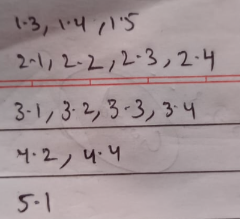
- ## Intro
	- ### Transpose
		- $(A+B)^T=A^T+B^T$
		- $(AB)^T=B^TA^T$
		- Symmetric Matrix
			- $A^{T}=A$
		- Skew symmetric
			- $A^{T}=-A$
	- ### Inner(dot product) and Outer Product
		- 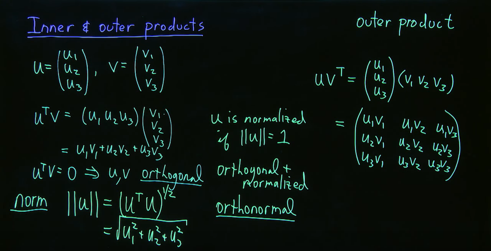{:height 267, :width 504}
		- norm = ||u|| = magnitude of vector
	- ### Inverse
		- Non singular matrix $|A| \ne 0$
		- $(AB)^{-1}=B^{-1}A^{-1}$
		- $(A^T)^{-1} = (A^{-1})^T$
		- $A^{-1}=\frac{1}{ad-bc}$ adj(A)
		- adj(A) = $$C_{ij}^T$$
			- $c_{ij}=\left(-1\right)^{i+j}M_{ij}$ where $$M_{ij}=\det\left(A\right)$$ leaving i, j row and col aside
	- ### Rotation Matrix
		- 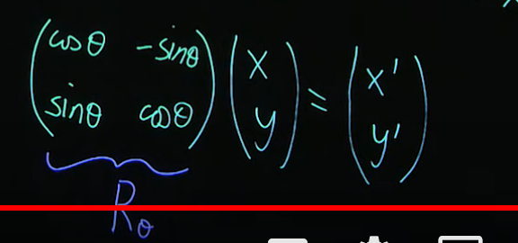{:height 186, :width 376}
	- ### Orthogonal Matrix
		- $Q^{-1}=Q^T$
		- $QQ^T=I$
	- ### Permutation Matrix
		- Identity matrix with row/column permuted
		- Perform Same op (as on original matrix in Gaussian elimination) to Identity matrix to get permutation matrix.
		- 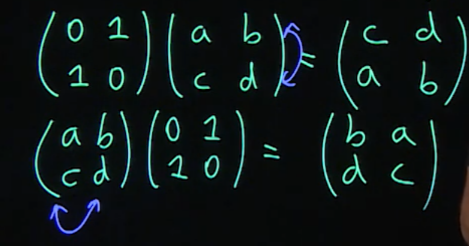{:height 201, :width 387}
- ## Gaussian elimination
	- 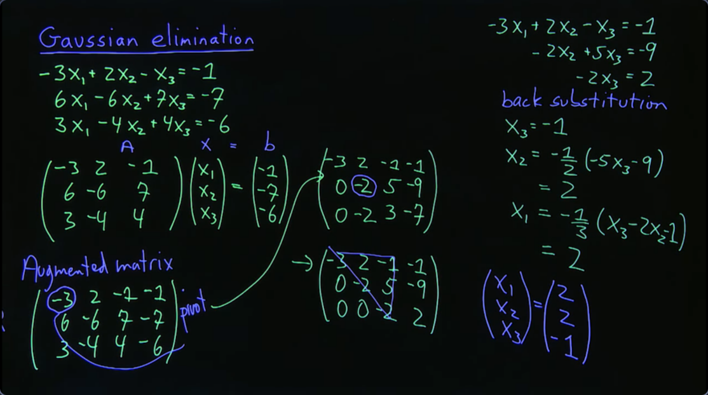{:height 311, :width 540}
	- Ax=b
	- Augmented Matrix
	- Make **UPPER TRIANGULAR MATRIX** from pivot(below) from row operations & then perform back substitution.
	- Breakdown: Permanent -> all pivot 0, row interchange won't fix; temporary -> pivot = 0 fix by row interchange
	- ### Allowed operation
		- Ri -> k Ri
		- Ri -> k Ri + p Rj
		- Ri <-> Rj
	- ### Reduced Row echelon form
		- Make number below and above pivot zero and _make pivot element 1_
		- 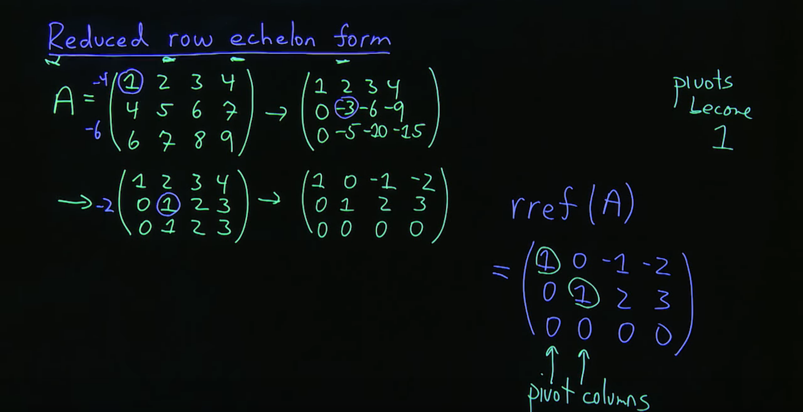{:height 326, :width 613}
		- #### Computing Inverse using Reduced Row echelon form
			- 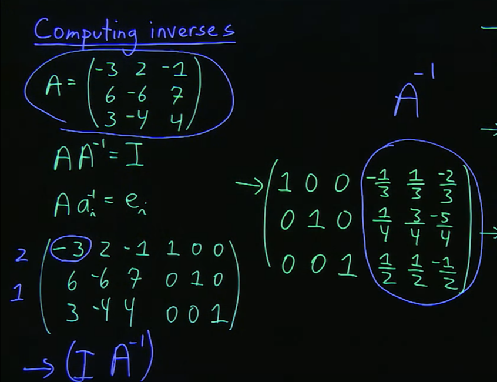{:height 292, :width 367}
	- ### Elementary/Elimination Matrix
		- M3M2M1A = U
		- 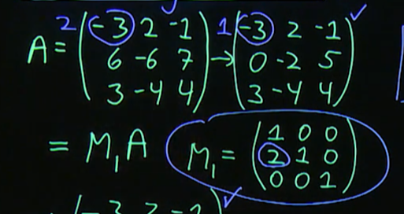{:height 198, :width 376}
	- ### LU Decomposition
		- $E_{21} = M_1$ here (as $R_2 +x R_1$)
		- 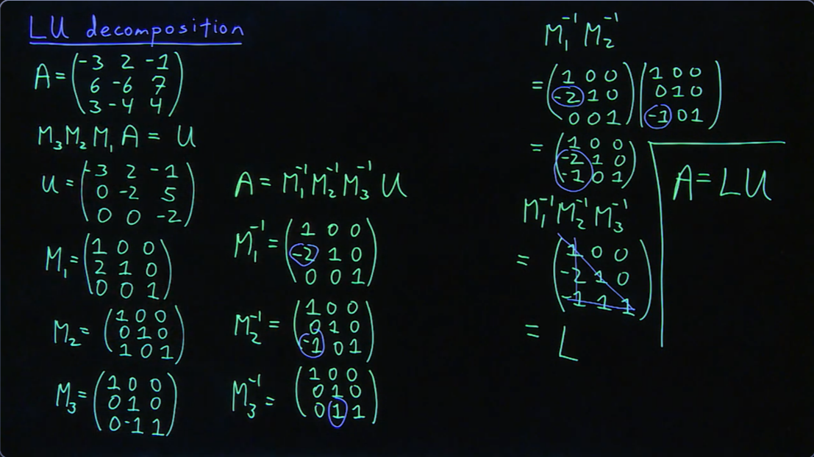{:height 291, :width 498}
		- #### (LU)x = b
			- 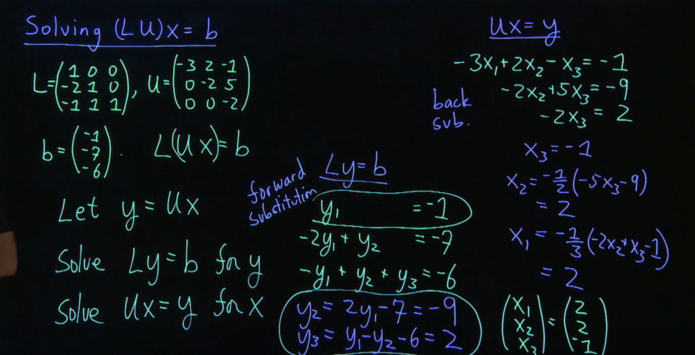{:height 305, :width 583}
	- ### triple factorizations LDU
		- D = Diagonal matrix
		- A=LDU, here D is diagonal (matrix) with element of U and U diagonal become all 1s
- ## Vector Space
	- set of vector(_column matrices_) + set of scalar & is closed under vector addition, scalar multiplication
	- Null space | Column space | Row space | Left null space
	- #### Linear Independent vector {u1, u2, ...., un}
		- c1u1 + c2u2 + ... = 0 has only solution c1=c2=...=0
		- No vector in set can be written as linear combination of other vector
	- 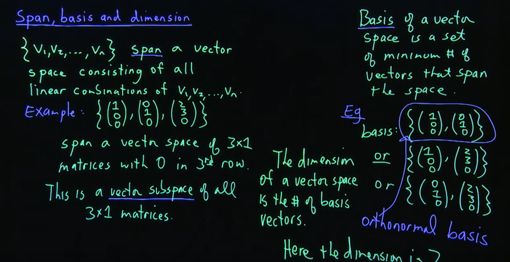{:height 324, :width 602}
		- Prefer orthonormal basis
	- 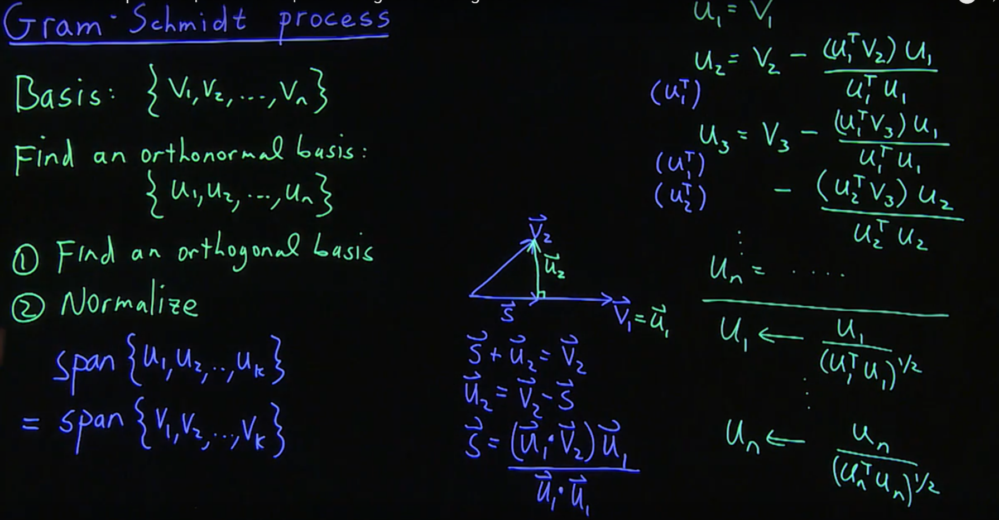{:height 325, :width 615}
	- a.b = a * b^T
	- ### NULL(A)
		- Vector space (x) such that Ax=0
		- Find rref(A) | 0 (augment with 0 column at rightmost) => derive equations
		- Written in form of linear combination of column vector
		- Equate constant row = 0 if exists for calculating Null(A) in augmented matrix in rref
		- _Dimension = # of non-pivot columns_
		- #### Applications
			- Fewer equation than unknowns (Ax=b)
				- u = general vector in Null(A)  found from solving keeping Ax=0 (in terms of some _free variables_)
				- v be vector that solves Ax=b, can assign some constant value to free variable to make them independent
				- then x = u + v
		- 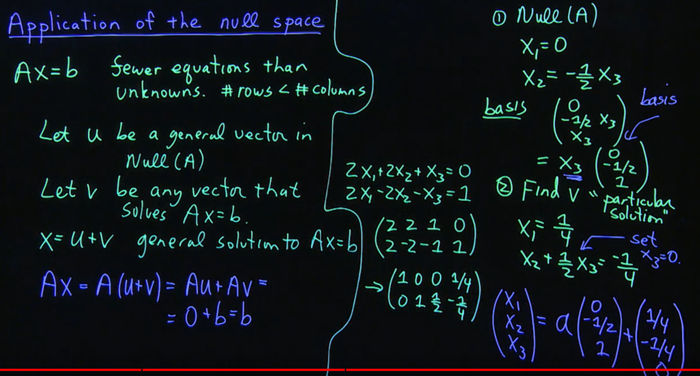{:height 366, :width 661}
	- ### Column Space
		- Span spanned from matrix x column matrix
		- _Dimension = # of pivot columns_
		- 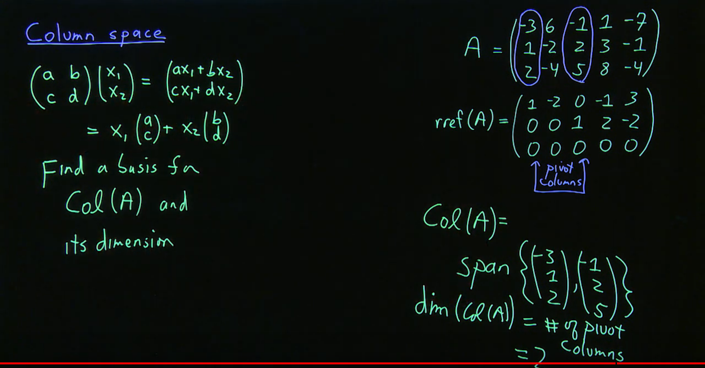{:height 341, :width 637}
	- ### Row Space
		- Col Space($A^T$)
		- Orthogonal to vector in Null space
		- _Dimension = # of pivot columns_ = Dimension(column space) = _rank(A)_ = No. of linearly independent rows or column
		- Dimension(row space) + Dimension(null space) = # of column
	- ### Left Null Space
		- Null Space($$A^T$$)
		- $A^Tx=0$
	- ### Determinant
		- 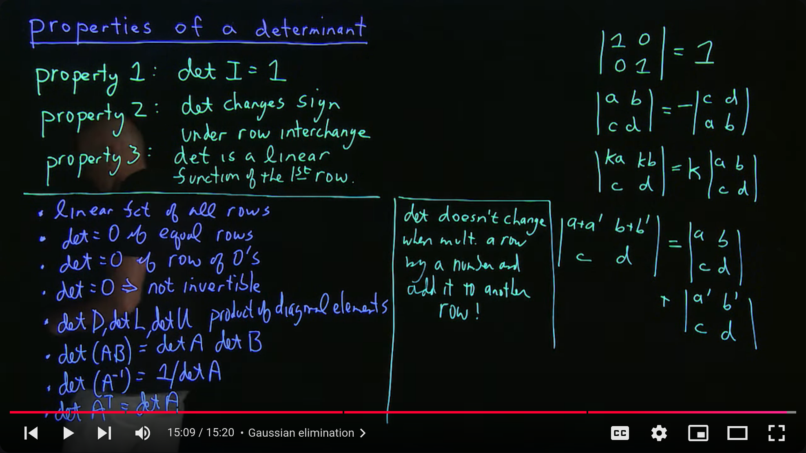{:height 483, :width 837}
		- Mij -> (-1)^(i+j) -> Transpose -> adj A
		- 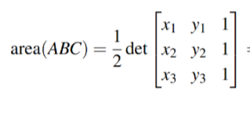
- ## Eigen value and eigen vector
	- $AX = \lambda X$ or $(A-\lambda I)X= 0$
	- $|A - \lambda I| = 0$
	- n order polynomial
	- Trace = sum of diag
	- $\lambda$ is eigen value, X is eigen vector
	- X = Column vector
	- 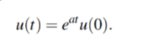
	-