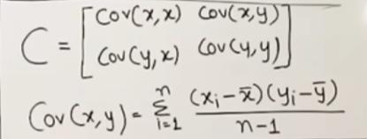
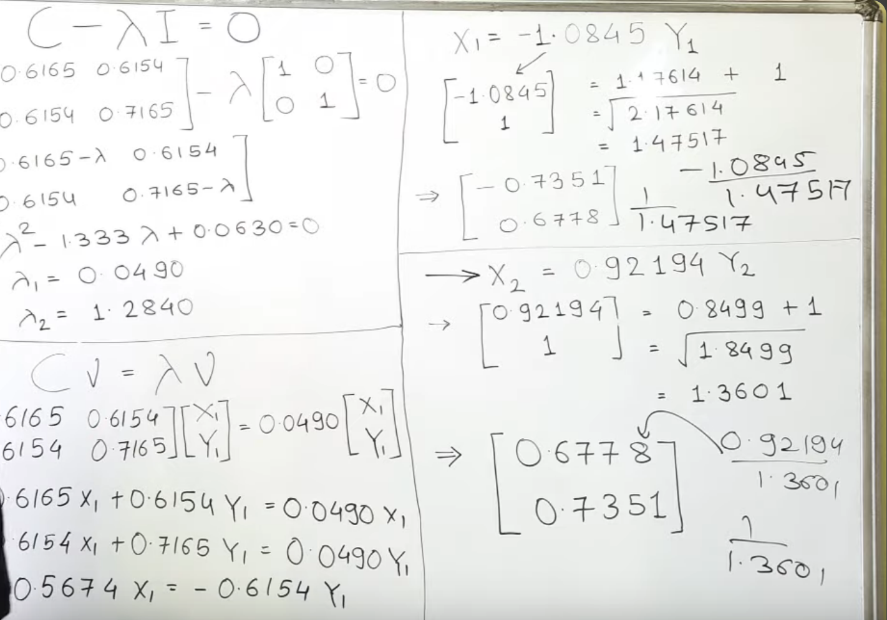
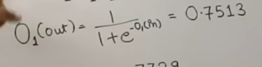
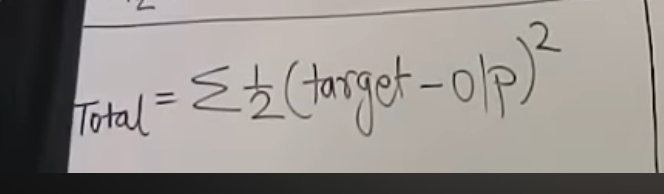
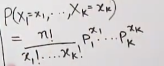

### Principle Component Analysis
	- Reduce dimension by changing POV
	- Covariance matrix /Eigen vector/matrix
		- 
		- {:height 296, :width 406}
- ### Recall / Precision
	- Recall = True-Positive/Actual Yes
	- Precision = True-Positive/Predicted-Yes
	- Type I -> False Positive
		- {:height 218, :width 541}
		- ### Backpropogation
			- 
			- Error
				- {:height 160, :width 421}
			- 
			-
		-