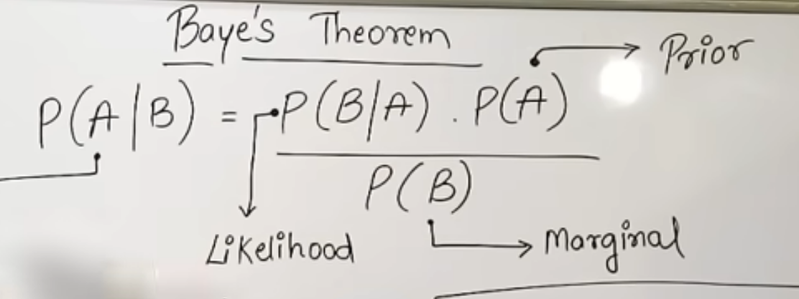

- Machine Learning: Input Data -> Program
- Train -> Data + Target Attribute
- Test -> Actual Value : Predicted Value
- Over-fitting: Too many features
- Under-fitting: Very less features
- ### Feature Selection Methods
	- #### Filter Method - Coorelation coefficient
		- If a feature and target variable are related, else remove them
	- #### Wrapper Method
		- ##### Recursive feature elimination
			- Try all permutations, and then eliminate with highest accuracy
			- Expensive to calculate
	- #### Embedded Method - Decision Tree
		- Don't suffer from over-fitting like in wrapper
- ### Classifier
	- Gives possibility (+1/-1) and _probability_(used in tie breaker for positives) of a class(target value) from feature
	- 
	- One vs All
		- No. of classifier = no. of class
	- One vs one
		- Combination of Pair of class
		- No of classifier = n(n-1)/2 where n=no. of class
- ### Principle Component Analysis
	- Reduce dimension by changing POV
	- Principle Component should be independent of each other (orthogonal) and priority in order (PC1 > PC2 ......)
	- Covariance matrix /Eigen vector/matrix
		- 
		- {:height 296, :width 406}
	- Covariance -> |$C-\lambda I$| = 0 -> CV = $\lambda$V (where V is eigen vector= [x1 y1]) -> assume y1 = 1 and find x1 -> y1 = $$y1/\sqrt{x^2+y^2}$$ & x1 = $$x1/\sqrt{x^2+y^2}$$
- ### Confusion Matrix
	- Pred X vs Actual Y NO, YES
	- Recall = True-Positive/Actual Yes
	- Precision = True-Positive/Predicted-Yes
	- Accuracy = Correct Prediction/Total
	- Error = 1 - Accuracy
	- Type I -> False Positive
	- Type II error -> False Negative
- ### Curse of dimensionality
	- Threshold after which accuracy start to decrease
- ### Managing missing record
	- Remove record
	- Create sub-model (if feature A is missing, then make a sub-model with A as target variable)
	- Mean, Median, Mode
- ### Categorical Data
	- One hot encoding(all in 1 & 0) -> Dummy encoding(eliminate 1st or last feature) -> Effect Coding scheme(-1 if all are 0)
- ### Regression Classification
	- Outliers: Extremities (less effective features on target)
	- Multi-collinearity: Independent variable are co-related
	- #### Linear Regression
		- Continuous linear relationship
		- 
		- y = bx + a (or more x -> multiple linear Reg) [a,b are regression coeff]
	- #### Logistic Regression
		- Dependent variable is binary (true or false, 0 or 1)
		- Uses probability
		- Sigmoid
			- $1/(1+e^{-x})$
			- Logit R -> have a cutoff at 0.5
- ### Naive Bayes Classifier
	- {:height 218, :width 541}
	- Feature set F = {$y_1, y_2, y_3$}, then find $x_i(\in X)$ $\ni$ $P(F|x_i) = P(y_1|x_i) P(y_2|x_i) P(y_3|x_i)$ is maximum
	- Variants (Not in syllabus)
	  collapsed:: true
		- {:height 413, :width 565}
		- Gaussian - continuous feature value
- ### Support Vector Machines
	- 
	- Marginal plane should be max separated and equidistant from best fit line
	- {:height 319, :width 342}
	- Cost function: Maximise 2/|w|
	- Loss function: MInimise |w|/2
		- {:height 257, :width 472}
	- #### Regression
		- {:height 201, :width 488}
		- {:height 107, :width 478}
	- SVM Kernel -> add dimension to reduce confusion (can't classify in hyperplane can be be classified in higher dimension)
		- 
- ### KNN
	- {:height 163, :width 542}
- ### Decision tree
	- {:height 291, :width 745}
	-
	-