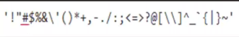
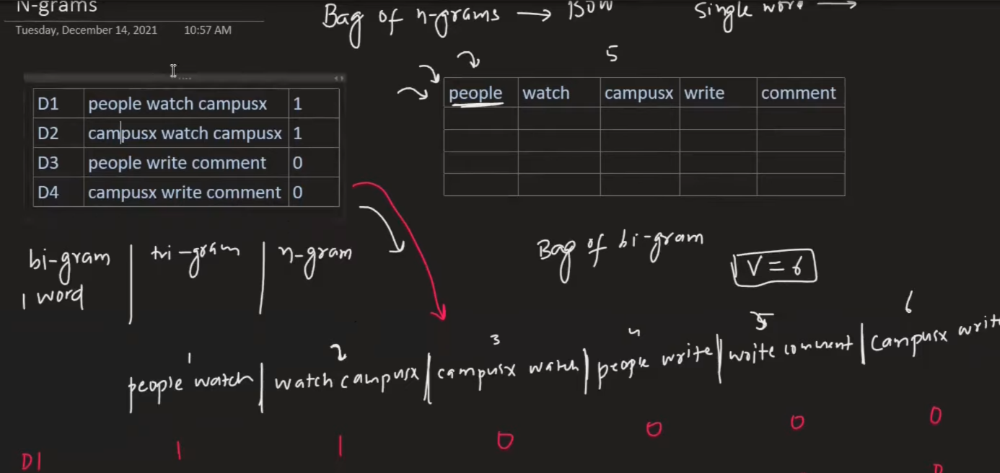
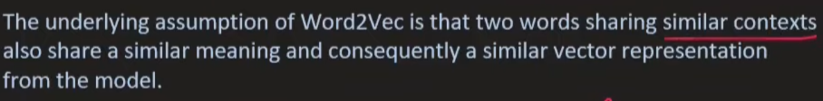

- Source: https://youtube.com/playlist?list=PLKnIA16_RmvZo7fp5kkIth6nRTeQQsjfX&si=7309uFb4G9YqrBe7
- ## Introduction
	- ### Common NLP tasks
		- Document Classification
		- Sentiment Analysis
		- Information Retrieval
		- POS tagging
		- Language Detection/Translation
		- Conversational Chatbot
		- Knowledge Graphs
		- Text Summarization
		- Topic Modelling/Text Generation/Spell Check/Text Parsing/ Speech to Text
	- ### Approach
		- Heuristic: Rule based, wordnet, open mind common sense
		  logseq.order-list-type:: number
		- Machine Learning: Naive Bayes, Logistic Regression, SVM etc
		  logseq.order-list-type:: number
		- Deep learning: Have sequential context. RNN, LSTM, GRU/CNN, transformers, autoencoders
		  logseq.order-list-type:: number
	- ### Challenges in NLP
		- Ambiguity
		- Contextual Words
		- Colloquialisms and slang
		- Synonym
		- Irony, Sarcasm and tonal diff
		- Spelling Errors
		- Creativity
		- Diversity
- ## NLP Pipeline
	- Data Acquisition -> Text Prep(Cleanup, Pre-processing) -> Feature Engineering -> Modelling (Building, Eval) -> Deploy
	- Data Acquisition
		- Less data: Data augmentation using synonym, bigram flip (flip word pair), back translate, add noise
	- Text Preparation
		- Cleaning: HTML/tag cleaning, emojis, spelling
		- Basic pre-processing
			- Basic: Tokenization -> Sentence or Word
			- Optimal: Stop Word remove(which add no meaning), Stemming(convert to root tense form), Removing digits/punctuation, lower-casing, language detection
		- Advanced pre-processing
			- POS tagging (done without stop word removal)
			- Parsing
			- Coreference Resolution (Replace pronoun with person/entity)
	- Feature Engineering
		- Text into numbers (eg sentiment on text, # of +ve words etc)
		- Deep learning don't require feature engineering, while ML does, but lose on model interpretability.
	- Modelling
		- Modelling: Heuristic, ML Algo, Deep Learning (Transfer Learning), Cloud API
			- Amount/nature of data, if low -> heuristic, then increase use heuristic as feature in ML Algo then maybe deep if needed
		- Evaluation: intrinsic (recall, precision, perplexity etc), extrinsic (business logic based)
	- Deployment
		- Deploy
		- Monitoring
		- Update
- ### Text Preprocessing
	- Lowercasing
	  logseq.order-list-type:: number
	- Remove HTML tags: Using regex
	  logseq.order-list-type:: number
	- Remove URLs: Using regex
	  logseq.order-list-type:: number
	- Remove Punctuation: 
	  logseq.order-list-type:: number
		- 
		- Lemmetization can produce side-effects like Hello!, Hello, Hello, ! etc
	- Chat Word treatment: rofl, lmao
	  logseq.order-list-type:: number
	- Spelling correction
	  logseq.order-list-type:: number
	- Removing stop words: a, the, of, are, my (not done in POS tagging)
	  logseq.order-list-type:: number
	- Handling emojis: either remove or demojify.
	  logseq.order-list-type:: number
	- *Tokenization*
	  logseq.order-list-type:: number
		- Problems: Prefix($10), Suffix(10km), Infix(new-york), Exception(U.S.)
		  logseq.order-list-type:: number
		- Sentence Tokenization and Word Tokenization
		  logseq.order-list-type:: number
	- Stemming
	  logseq.order-list-type:: number
		- Inflection: walk, walking, walked etc
		- {:height 143, :width 547}
		- Faster than lemmetization, but non readable to user
	- Lemmetization
	  logseq.order-list-type:: number
		- {:height 197, :width 479}
- ### Feature Extraction
	- Corpus: All words
	- Vocabulary: All unique words
	- Document: Each data
	- One hot encoding:
	  logseq.order-list-type:: number
		- {:height 116, :width 460}
		- {:height 196, :width 465}
		- Cons
			- Sparsity (lots of 0s) => Overfitting
			- No fixed size
			- OOV (out of vocabulary for new input)
			- No semantic meaning (weight-age to word closer)
	- Bag of words
	  logseq.order-list-type:: number
		- best for text classification
		- binary = True, for sentiment analysis
		- {:height 120, :width 622}
		- order of words, doesn't matter
		- semantic relationship: vector relationship
		- Cons
			- sparsity
			- OOV
			- Ordering
			- negation doesn't create large change
	- n-grams
	  logseq.order-list-type:: number
		- bi-grams
			- {:height 287, :width 645}
			- semantic meaning
	- Tf-Idf
	  logseq.order-list-type:: number
		- Give weights to word (more to word in document, but not in corpus)
		- 
		- 
		- TF = Term frequency, IDF = Inverse document frequency
		- {:height 338, :width 340}
		- Cons:
			- Sparsity, OOV, sematics, dimension
	- Custom features
	  logseq.order-list-type:: number
		- Like # of positive words, ratio etc
- ### Word2Vec
	- Word embeddings
		- 
		- Type: 1. Freq (TfIdf, BoW) 2. Prediction (word2vec)
	- Capture semantic meaning, low dimension, dense vectors
	- Using deep learning
	- Generate custom features, and score based on that
	- 
	- 
	- Types of word2vec
		- CBOW
		  logseq.order-list-type:: number
			- Context window = say 3, 5 etc
			- Context word as input, target word as output and train
			- for small data
			- {:height 252, :width 236}
			- {:height 273, :width 331}
				- one hot encoding
		- Skip-gram
		  logseq.order-list-type:: number
			- Reverse the problem of CBOW, input becomes output and vice versa.
			- 
			- {:height 222, :width 311}
			- for large data
			- Improve word2vec: Increase training data, context window, dimension of vector
- ### Text classification
	- Types: Binary(2 class), Multiclass, Multilabel(one can have > 1 class)
	- Approach
		- Heuristic
		  logseq.order-list-type:: number
		- Using API
		  logseq.order-list-type:: number
		- Machine Learning
		  logseq.order-list-type:: number
			- BoW/ngrams: Use naive bayes or random forest
			  logseq.order-list-type:: number
			- TfIdf
			  logseq.order-list-type:: number
			- Word2Vec: Pretrained (if atleast 80% match), or own
			  logseq.order-list-type:: number
				- For document vectorization, take mean of vector sum of all words
		- Deep Learning: RNN , LSTM, CNN etc
		  logseq.order-list-type:: number
- ### POS Tagging
	- Labelling word with appropriate part of speech
	- Application
		- Named Entity Recognition: extracting entity like person
	- Viterbi