# ss
	- 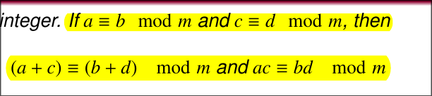{:height 99, :width 468}
	- 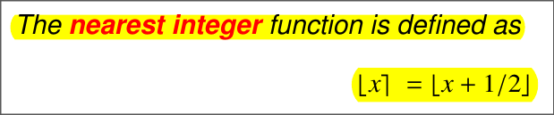{:height 100, :width 469}
	- 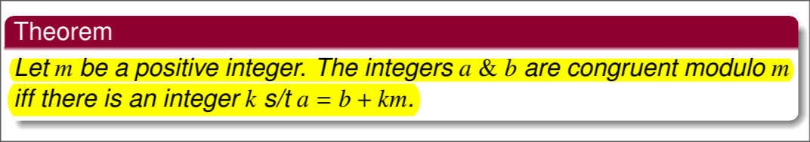{:height 100, :width 550}
	- 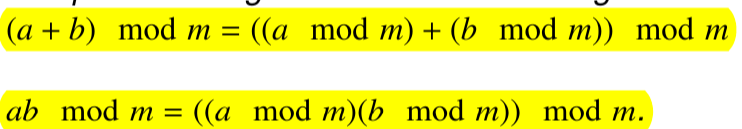{:height 105, :width 547}
	- 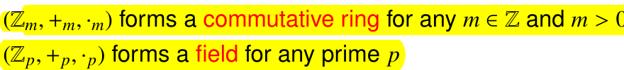{:height 73, :width 560}
	- For a number of base b
		- 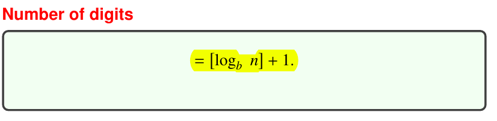{:height 106, :width 361}
	- n! -> n-2 . n . [log2 n + 1]
	- 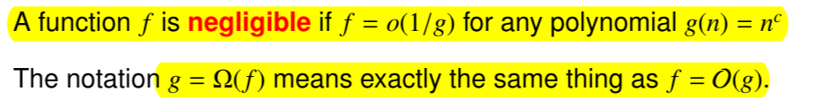{:height 71, :width 495}
	- 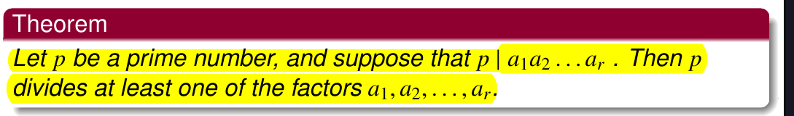{:height 94, :width 595}
	- Fundamental theorem of arithmetic
		- 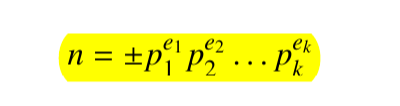{:height 75, :width 253}
	- 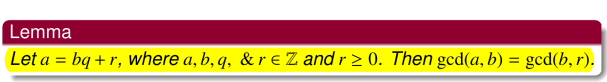{:height 77, :width 510}
	- 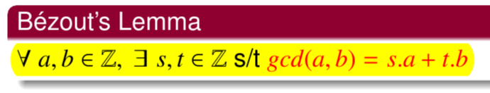
		- s 1 0 ; t 0 1
			- s = s1 - q s2
		- {:height 360, :width 565}
		- 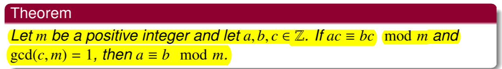
		- 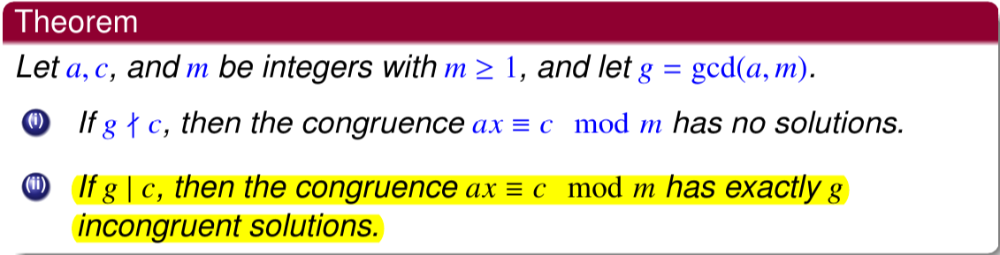
		- 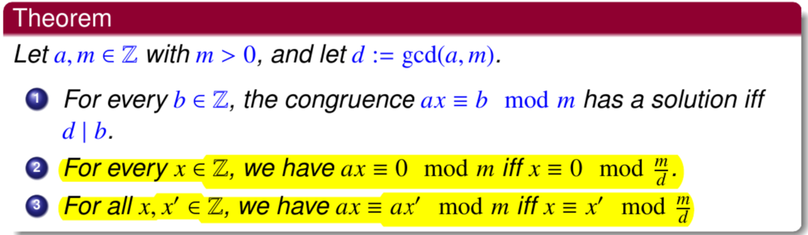
		- 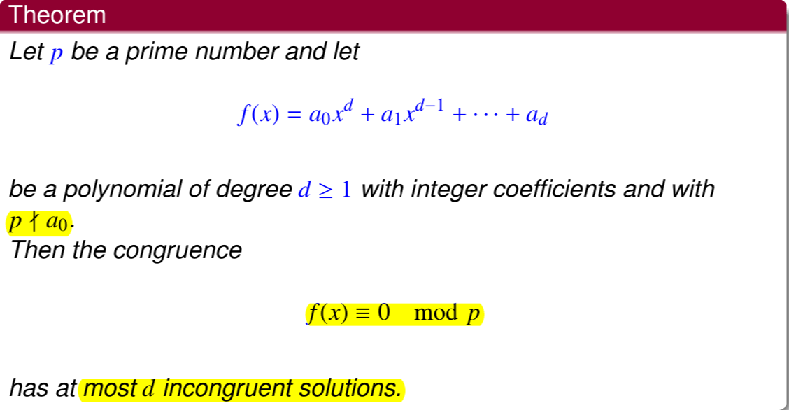
		- Fermat little theorm: Under Zn a^(n-1) = a
		- 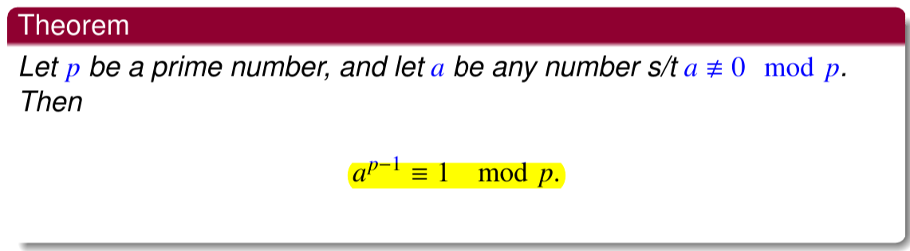
		- 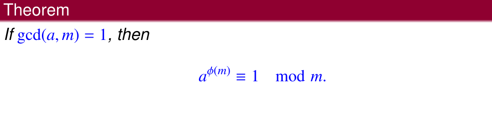
		- 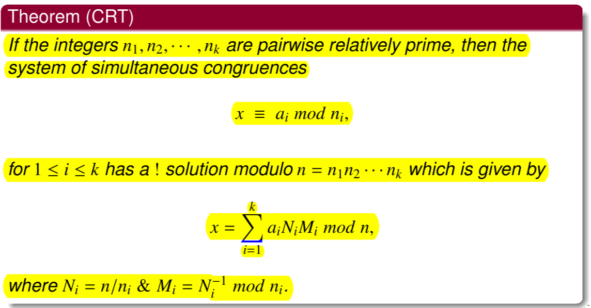
		-
		-
		-
		-
- ## Symbols
	-