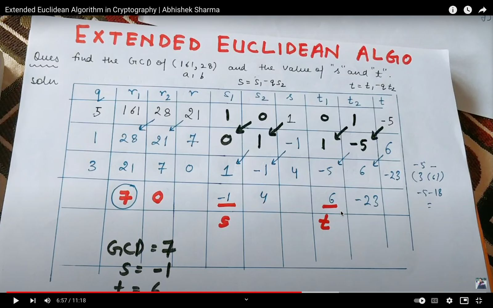
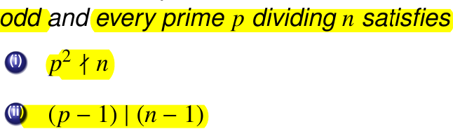

# ss
	- {:height 99, :width 468}
	- {:height 100, :width 469}
	- {:height 100, :width 550}
	- {:height 105, :width 547}
	- {:height 73, :width 560}
	- For a number of base b
		- {:height 106, :width 361}
	- n! -> n-2 . n . [log2 n + 1]
	- {:height 71, :width 495}
	- {:height 94, :width 595}
	- Fundamental theorem of arithmetic
		- {:height 75, :width 253}
	- {:height 77, :width 510}
	- {:height 99, :width 495}
		- s 1 0 ; t 0 1
			- s = s1 - q s2
		- {:height 360, :width 565}
		- {:height 86, :width 579}
		- {:height 157, :width 590}
		- {:height 177, :width 594}
		- {:height 314, :width 577}
		- Fermat little theorm: Under Zn a^(n-1) = a
		- {:height 167, :width 546}
			- Composite no. satifying it is pseudo prime to base a.
			- Test for composite (Miller-Rabin primality)
		- {:height 133, :width 519}
		- {:height 296, :width 557}
		- Mersenne prime : 2^p − 1
			- {:height 93, :width 581}
		- σ(n) = sum of all divisors of n (including 1 and n)
			- σ(p^k ) = 1 + p + p^2 + · · · + p^k
		- {:height 87, :width 583}
			- {:height 128, :width 419}
		- Miller rabin test (Fermat test)
			- {:height 167, :width 485}
			- q = a - 1 / 2^max
			- Test for composite
		- Euler test
			- a^(n−1)/2 ≡ ±1 mod n. => probably prime; n = odd prime
		- AKS
			- 
			-