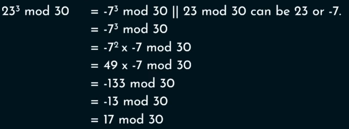
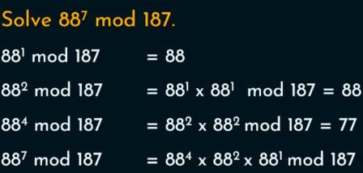

## Modular Arithmetic
	- 15 \equiv 3 mod 12
	- a \equiv b mod m
		- a = km + b
	- ### Properties
		- (a % n + b % n) %n = (a + b) % n
		- (a % n - b % n) %n = (a - b) % n
		- (a % n * b % n) %n = (a * b) % n
- ## Modular Exponentiation
	- $a^b$ mod m
	- {:height 191, :width 483}
	- {:height 163, :width 315}
	- Last n digits of a number
- ## GCD - Euclidean Algorithm
	- Repeated division till remainder is 0
		- GCD(x, 0) = x
		- GCD(a, b) = GCD(b, a mod b)
	- Relative Prime : GCD(a, b) = 1
	- ### Euler Totient Function \Phi(n)
		- \Phi(n) = No of positive integers less than n who are relative prime to n
		- |Criteria of n|$$\Phi(n)$$|
		  |--|--|
		  |n is prime|n - 1|
		  |n = p * q, where p, q is prime and p \ne q|(p - 1)(q - 1)|
		  |n = a * b[:br]either or both are composite|$n * (1 - 1/p1) (1 - 1/p2) .....$[:br][:br]where p1, p2,.... are distinct primes[:br]n=${p1}^{a1}.{p2}^{a2}.{p3}^{a3}.....$|
	- ### Fermat's Little Theorem
		- If p is prime and a is +ve integer not divisible by p
		- $a^{p-1}\equiv 1\ mod\ p$
	- ### Euler's Theorem
		- Every positive integer a & n and are relatively prime, then
			- $a^{\Phi(n)} \equiv\ 1\ mod\ n$
			-
-