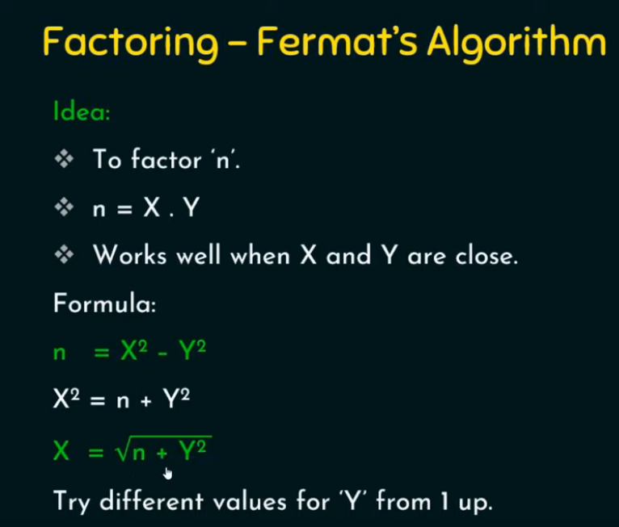

## Modular Arithmetic
	- 15 \equiv 3 mod 12
	- a \equiv b mod m
		- a = km + b
	- ### Properties
		- (a % n + b % n) %n = (a + b) % n
		- (a % n - b % n) %n = (a - b) % n
		- (a % n * b % n) %n = (a * b) % n
- ## Modular Exponentiation
	- $a^b$ mod m
	- {:height 191, :width 483}
	- {:height 163, :width 315}
	- Last n digits of a number
- ## GCD - Euclidean Algorithm
	- Repeated division till remainder is 0
		- GCD(x, 0) = x
		- GCD(a, b) = GCD(b, a mod b)
	- Relative Prime : GCD(a, b) = 1
	- ### Euler Totient Function \Phi(n)
		- \Phi(n) = No of positive integers less than n who are relative prime to n
		- |Criteria of n|$$\Phi(n)$$|
		  |--|--|
		  |n is prime|n - 1|
		  |n = p * q, where p, q is prime and p \ne q|(p - 1)(q - 1)|
		  |n = a * b[:br]either or both are composite|$n * (1 - 1/p1) (1 - 1/p2) .....$[:br][:br]where p1, p2,.... are distinct primes[:br]n=${p1}^{a1}.{p2}^{a2}.{p3}^{a3}.....$|
	- ### Fermat's Little Theorem
		- If p is prime and a is +ve integer not divisible by p
		- $a^{p-1}\equiv 1\ mod\ p$
	- ### Euler's Theorem
		- Every positive integer a & n and are relatively prime, then
			- $a^{\Phi(n)} \equiv\ 1\ mod\ n$
	- ### Primitive Root
		- a is said to be primitive root of prime number p if a mod p, $$a^2$$ mod p .... $a^{p-1}$ mod p are distinct.
	- ### Multiplicate Inverse
		- Only if both number are relatively co-prime
		- {:height 189, :width 227}
		- ### Using extended euclidean algorithm
			- 
			- 
- ## Chinese Remainder Theorem
	- X \cong $a_1$ mod $m_1$
	  X \cong $a_2$ mod $m_2$
	  ...
	  X \cong $a_n$ mod $m_n$
		- This equation has unique solution if moduli are distinct and relatively prime.
	- X = ($$a_1M_1M_1^{-1} + a_2M_2M_2^{-1} + ...$$) mod M
		- M = $$m_1*m_2*m_3*....$$
		- $M_n$ = $$M/m_n$$
		- $M_n * M_n^{-1} \cong 1\ mod\ m_n$
	- kX \cong a mod m
		- X \cong $k^{-1}$ a mod m
- ## Discrete logarithm problem
	- {:height 190, :width 561}
	- {:height 231, :width 303}
- ## Factoring Algorithm
	- {:height 309, :width 351}
	-