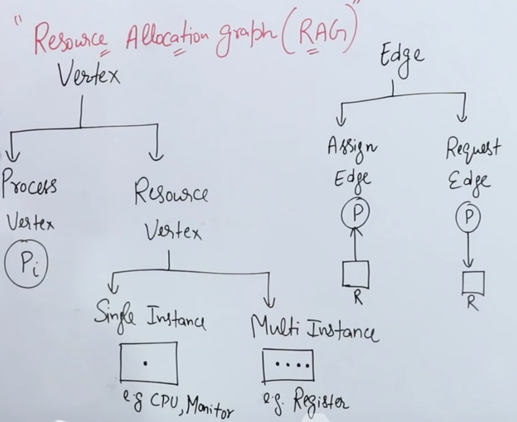

# Process
collapsed:: true
	- ## Process synchronization
		- Process
			- Cooperative process : Dependent; share variable/memory/buffer/code/resources etc
				- Race conditions -> Synchronization
			- Independent process
		- ### Problems
			- #### Producer Consumer Problem
				- Producer produces onto buffer and consumer consumes it! Case of race conditions due to shared variable.
				- {:height 276, :width 470}
				- Solution
					- {:height 324, :width 468}
			- #### Printer spooler Problem
				- {:height 349, :width 429}
			- #### Reader Writer Problem
				- Database R/W problem on same data
				- rc = read counter
				- {:height 327, :width 367}
			- #### Dining Philosopher's Problem
				- {:height 253, :width 208}
				- {:height 279, :width 330}
				- Deadlock: If all philosopher takes there left fork, then nobody can eat and signal can't be given either.
		- ### Critical Section
			- Part of program having shared resources accessed by various processes
			- Prefix and Suffix by entry and exit section in program and wait till they are complete, before completing their own's.
			- #### Synchronization Mechanism
				- Mutual Exclusion: One access at a time
				- Progress: Mutual blocking and no progress
				- Bounded Wait: Starvation on one process, due to multiple allocation to single process making other starve for lock on critical section.
				- No assumption related to H/W and speed
		- ### Synchronization
			- #### LOCK Variable
				- ```c
				  while (LOCK == 1); // entry 
				  LOCK = 1;          // entry
				  // access critical section
				  LOCK = 0;          // exit
				  ```
				- User mode; Multi-process; Mutual exclusion is not guaranteed if a process preempt after running instruction 1.
			- #### Test and set
				- Entry point must be *atomic instructions*.
				- It's guaranteed that if a process is currently performing a `test_and_set`, no other process may begin another `test_and_set` until the first process's `test_and_set` is finished.
				- ```c
				  while (test_and_set(&lock)); // atomic op
				  // access critical section
				  LOCK = false;
				  ```
				- ```cpp
				  bool test_and_set(bool *target) {
				    bool r = *target;
				    *target = true;
				    return r;
				  }
				  ```
			- #### Turn Variable (Strict Alternation)
				- For _two process only_, user mode, alternating turns
				- Process Pa
					- ```c
					  while (turn != 0);
					  // critical section
					  turn = 1;
					  ```
				- Process Pb
					- ```c
					  while (turn != 1);
					  // critical section
					  turn = 0;
					  ```
			- #### Semaphore
				- Binary Semaphore (0, 1)
				- Counting Semaphore (-\infty to \infty)
				- P() or Down or Wait -> To add a new entry section
				- V() or Up or Signal, Wait or Release -> To remove a entry via exit section
				- ```c
				  Down(Semaphore S) {
				    S.value -= 1;
				    if (S.value < 0) {
				      // put process(PCB) in suspend list
				      sleep();
				    }
				    else {
				      return;
				    }
				  }
				  ```
				- ```c
				  Up(Semaphore S) {
				    S.value += 1;
				    if (S.value <= 0) {
				      // select process(PCB) in suspend list
				      wakeup();
				    }
				  }
				  ```
			- #### Binary Semaphore
				- ```c
				  Down(Semaphore S) {
				    if (S.value == 1) {
				      S.value = 0;
				    }
				    else {
				      // block this process(PCB) in suspend list
				      sleep();
				    }
				  }
				  ```
				- ```c
				  Up(Semaphore S) {
				    if (/*Suspend list is empty*/) {
				      S.value = 1;
				    }
				    else{
				      // select process(PCB) in suspend list
				      wakeup();
				    }
				  }
				  ```
	- ## Deadlocks
		- Waiting on some event that never happens (eg: Dining Philosopher's Problem)
		- Conditions
			- Mutual Exclusion : No resource interleaving
			  logseq.order-list-type:: number
			- No preemption : No release of resource at preemption
			  logseq.order-list-type:: number
			- Hold & Wait : Hold resources acquired & Wait for event(resources)
			  logseq.order-list-type:: number
			- Circular Wait : Loop
			  logseq.order-list-type:: number
		- ### Resource Allocation Graph
			- {:height 358, :width 431}
			- {:height 224, :width 422}
			- Waiting
				- Finite -> Starvation
				- Infinite time -> Deadlock
			- In single instance, if RAG has cycle -> Deadlock and vice versa
		- ### Deadlock Management
			- Deadlock Ignorance (Ostrich method) : Performant
			  logseq.order-list-type:: number
			- Prevention
			  logseq.order-list-type:: number
				- Avoid mutual exclusion
				  logseq.order-list-type:: number
				- Premption using scheduling algo (time quanta)
				  logseq.order-list-type:: number
				- No hold & wait: All the resource the process is given before start, not on demand.
				  logseq.order-list-type:: number
					- #### Banker's Algorithm
						- 
						- Remaining Need = Max Need - Allocation
						- Condition for no deadlock: Resources + Process > Total demand
				- Circular Wait: All resources are numbered and a process can request upcoming resource in increasing order of previous request. (Access 3rd now can access >3 resource only!)
				  logseq.order-list-type:: number
			- Avoidance (Banker's Algorithm) : Predetermine if safe or not!
			  logseq.order-list-type:: number
			- Detection & Recovery: Kill the process linearly/Resource preemption
			  logseq.order-list-type:: number
		-
- # Memory Management
  collapsed:: true
	- Multiprogramming: More & more process from secondary memory to RAM
		- CPU Utilization = 1 - K^n (n = no. of process in RAM at time; k = I/O time ratio)
	- Techniques
		- Contiguous - Fixed partition (static), Variable parition (Dynamic)
		- Non-contiguous - Paging, Mutilevel paging, Inverted paging, Segmentation, Segmented paging
	- ## Contiguous
		- ### Fixed partition (Static)
			- No of partitions are fixed, not the size
			- Spanning is not allowed. (Entire process need to be accommodated in one partition)
			- Internal fragmentation : Waste of memory space due to smaller process than the partition in RAM
			- Has a limit in max process size & degree of multi-programming/no. of process at a time.
			- External fragmentation: The RAM has sufficient memory but isn't contiguous to allot to a process.
		- ### Variable partition (Dynamic)
			- The partition are determined at runtime on demand and can be changed as well per need with no cap on numbers.
			- Pros: No internal fragmentation, no limit of no. of process/ process size.
			- Cons: External fragmentation (de-allocation creates holes in memory, which can be resolved using compaction i.e. moving non-allocated memory at whole together, but this is undesired) and allocation & deallocation is complex
			- {:height 208, :width 138}
			- #### Allocation Algorithms
				- First fit : To the first _fit_ hole after 0. (simple, fast, internal fragmentation)
				  logseq.order-list-type:: number
				- Next fit : To the next _fit_ hole after the previously allocated hole. (faster, internal fragmentation)
				  logseq.order-list-type:: number
				- Best fit : To hole with least internal fragmentation. (slow, least internal fragmentation, smaller holes may become unusable)
				  logseq.order-list-type:: number
				- Worst fit : To hole with max size. (slow, least internal fragmentation)
				  logseq.order-list-type:: number
	- ## Non-contiguous Memory
		- Single process is divided into multiple partition called _pages_.
		- RAM is also dividing in equal sized _frames_. Here, frame size = page size.
		- No external fragmentation
		- ### Paging
			- MMU stores map of Page no. to frame no. in _page table_ of process
			- CPU uses logical addressing(not physical address) using _page no_ and _page offset_.
				- page offset bit = log2 (size of frame)
				- Logical Address | Page No | Page Offset | ->
				  Physical Address | Frame no(= PageTable[Page No.]) | Frame Offset(=Page offset) |
				- Size of Page No + Page offset = Logical Address size (fixed by CPU)
				- No. of entry in page table = No. of pages
			- #### Pagetable entry
				- {:height 258, :width 562}
				- Valid/Invalid - If page is present or not. (due to virtual memory swapping)
				- Reference - If page was previously in main memory or not (L.R.U.)
				- Cache - Cache page
				- Dirty (Modify)- Modified page(user with write access), but write not commited to disk
				- If total size of pagetable > frame size, then it can't be stored at once in memory, so a new _outer_ pagetable need to generated which _maps **partition of page tables** onto frames_, and the former page table becomes _inner_ page table.
					- The inner pagetable is divided in _n_ partition of frame size and their map is stored in outer pagetable.
					- {:height 155, :width 464}
			- #### Inverted paging
				- Reverse of pagetable, maps **frame no** to _page no_ and process
				- Global store of pagetable, saves memory, but high search time (linear search)
				- {:height 263, :width 152}
			- #### Thrashing
				- If no. of process in cpu \uparrow, degree of multiprogramming increase, but after a point cpu utilization decrease due to increase in page faults due to process execution.
				- Best case only 1st page of all process in RAM
				- This decrease in CPU utilization due to increase page fault is thrashing.
				- Fixed using increase memory size or slowing long term scheduler.
		- ### Segmentation
			- Segmentation divides process into **variable size partition** of logical size/functions, rather than fixed size as in paging.
			- 
			- Logical address stores Segment No and Segment offset (size), size should not exceed the size in segment table, else TRAP is generated
			- Segment table -> Base address | Size
		- #### Overlay
			- Fitting process's size > main memory by splitting them in _independent_ partitions chunks and pass them one by one.
		- ### Virtual Memory
			- Page swap in(roll in)/swap out(roll out) to secondary memory.
			- Loads only required page of process required, not everything (local referential fetching -> if xth page is there, then also load x+1, x-1 etc)
			- #### Page fault
				- If frame not in main memory(as per page table[Valid/Invalid]) -> TRAP issued -> User to OS -> OS performs auth -> access page from logical address space(secondary memory) -> loads page into main memory -> update frame no in page table -> restore control to User
				- _Effective memory access time (EMAT)_ = p * (page fault service time) + (1 - p) * (main memory access time)
					- p = probability of page fault
					- page fault service time is of order ms
					- main memory access time is of order ns
			- #### Translation lookaside buffer (TLB)
				- Storing part of page table in _Cache_ in addition to Main memory to decrease EMAT.
					- Conventionally twice memory read is required to get a frame no. increasing latency.
				- 
				- Uses tags to map to frame no.
				- EMAT = Hit (TLB + x) + Miss (TLB + 2x)
					- x = memory access time
					- TLB = cache lookup time
		- ### Page replacement algorithm
			- #### FIFO
				- 
				- ##### Belady's Anomaly in FIFO
					- As no. of frames increase the page fault also increase, and hit decreases counterintutuively.
			- #### Optimal Page Replacement
				- Replace the page which is not used in longest dimension of time _in future_.
				- In other words, replace the page having min proximity IN FUTURE to current page with the newer entry.
			- #### LRU
				- Replace the least recently used page _in past_.
				- Searching in past takes time, but lesser page fault than FIFO.
			- #### MRU
				- Replace the most recently used page _in past_.
- # Disk Architecture
	- Disks has multiple **platters** -> has generally 2 **surface** (top/bottom) -> has concentric rings called **tracks** -> has **sectors** -> which store **data**
	- {:height 205, :width 150}
		- Actuator arm can only move front/back; Read write head
	- ### Disk access time
		- Seek time : (Average) Time taken by R/W head to reach desired track.
		- Rotation Time : Time taken for one full rotation (360 deg)
		- Rotational latency: Time taken to reach to desired sector. (half of rotation time)
		- Transfer time:
	-
	-