## Types of OS
collapsed:: true
	- ### Batch OS
		- Punch Cards or Magnetic Tapes => Operator
		- I/O bound op => CPU idle
	- ### Multiprogramming OS
		- Non premptive
		- P process will complete in entirety at once rather than a part/chunk except in case of IO bounds
		- Multiple Processes are stored are RAM
	- ### Multitasking/Time sharing OS
		- Premptive (P1 for some time, then to P2, then to P3...)
		- High response time
	- ### Other OS
		- #### Realtime OS
			- Hard : More strict on delays eg Missile systems
			- Soft : eg Gaming
		- #### Distributed OS
			- Distributed environment of independent computer across globe connected together
		- #### Clustered OS
			- Distributed OS acting as single OS over local network
			- Fault tolerance, scalability
			- eg: Supercomputer
		- #### Embedded OS
			- Specific functions only!
- ## Process State
	- 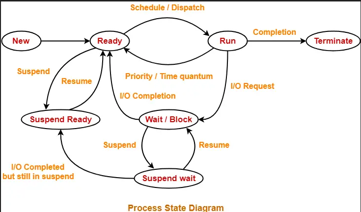{:height 281, :width 458}
	- Any State -> Suspend uses MTS (Medium Term Schedular)
	- New -> Ready LTS (Long Term Schedular)
	- Ready -> Runing STS (Short Term Schedular)
	- New, Suspend => Secondary Devices
	- Ready, Wait, Run -> RAM (Queue)
	- Terminate = Deallocation
	- Process has _Data/files, Code, Stack/Register_
	- 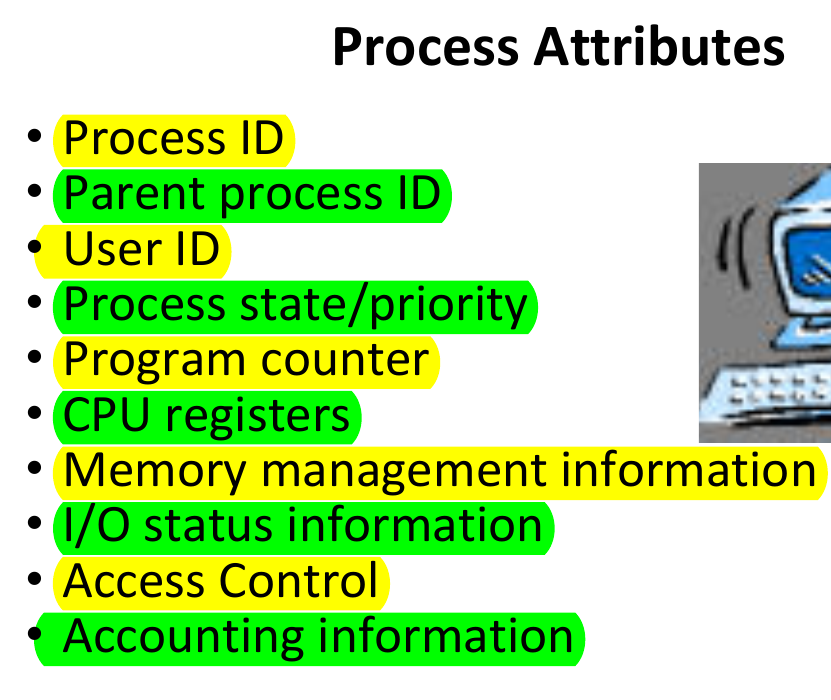{:height 410, :width 482}
	-
	- ### lseek
		- Move file pointer left/right
		- SEEK_SET : start
		- SEEK_CUR : curr
		- SEEK_END : end
	- ## System Calls
		- 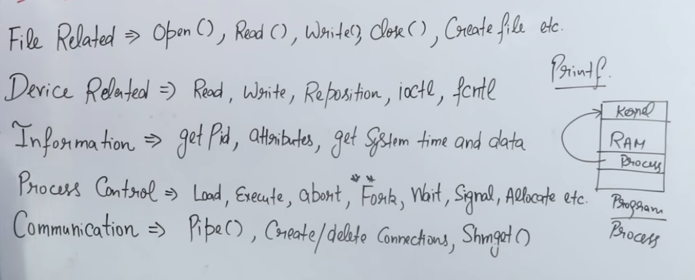{:height 262, :width 648}
	-
	- ## Fork()
		- create child process from parent process running from same stack/instruction pointer; multiprocessing
		- thread has more shared resources than fork()
		- fork() == 0 => Child Process
		  fork() == 1/+ve => Parent Process
		- fork() generates 2 process, one parent one child. So 2^n
	- ## User mode vs Kernel Mode
		- 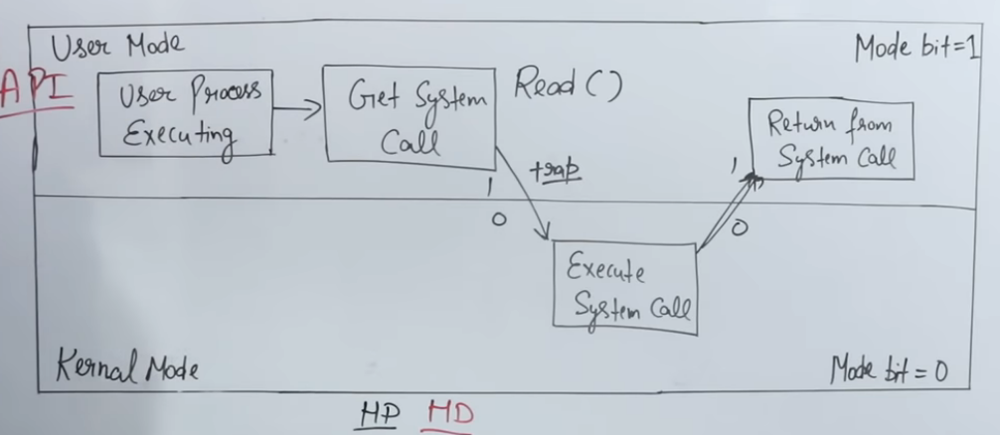{:height 293, :width 652}
	- ### Process & Threads
		- Threads have same data files and code, but different stack, registers.
		- 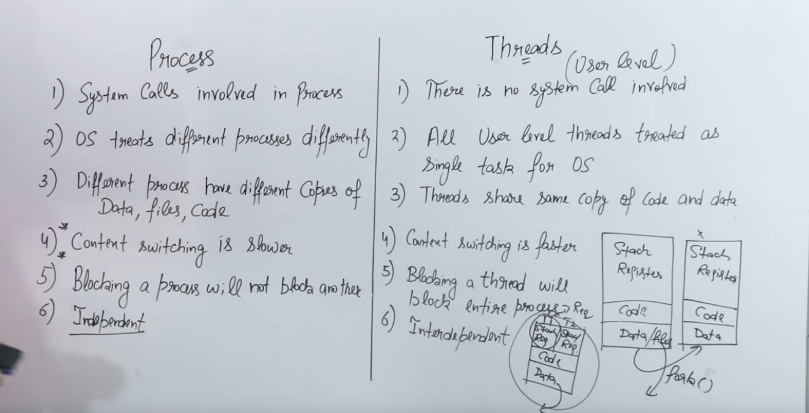{:height 299, :width 564}
		- 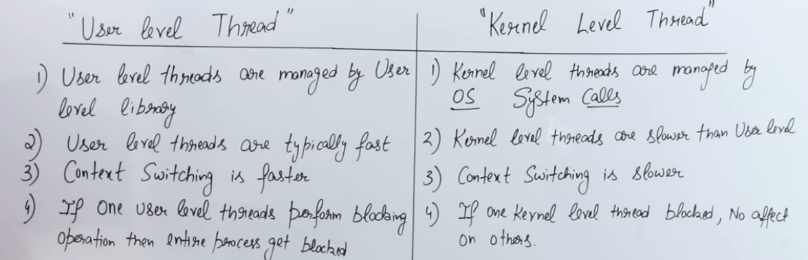
- ## Scheduling Algorithms
	- 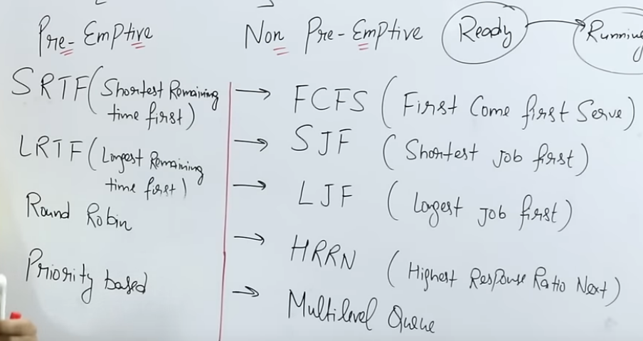
	- Arrival time: Time of arrival
	- Burst time : Duration to execute on CPU
	- Completion Time : Time at completion
	- Turn around Time = Completion Time - Arrival Time
	- Waiting Time = Turn around time - Burst Time
	- Response Time = The time at which process get CPU first time - Arrival time
	- |Algorithm|Criteria|Mode|
	  |--|--|--|
	  |FCFS|Arrival Time|Non-preemptive|
	  |SJF|Burst Time (even if different arrival time) [if same burst time then arrival time else process id]|Non-preemptive|
	  |SRTF (Preemptive SJF)|Burst Time but at each time quantum, values are compared Burst Time - Time Quanta passed for current process vs other process in ready state |Preemptive|
	  |Round Robin|Time Quantum (if burst time < quantum then don't idle)[:br]No. of context switch = No of time different process is loaded[:br]Current process is pop and push at last after arrival process|Preemptive|
	  |Pre-emptive Priority Scheduling|Priority compare at each time quantum (if conflict(same priority), then FCFS)[:br]smallest integer ≡ highest priority|Preemptive|
	  |Multilevel Queue|High priority - System -> Round Robin[:br]Medium priority - Interactive -> SJF[:br]Low priority - Batch -> FCFS|-|
	  |Multilevel Feedback Queue|Upgrade priority based on time elapsed for low priority process. Higher priority queue has more time quantum.|Preemptive|
	- Context Switching in preemptive, saved current state of process in CPU in PCB(Process control block) and start another
	- Round robin requires both ready queue and Running Queue (Gantt Chart)
	- CPU idleness = idle time / total time
	- CPU Usage  = usage time / total time
- ## From PDFs
	- 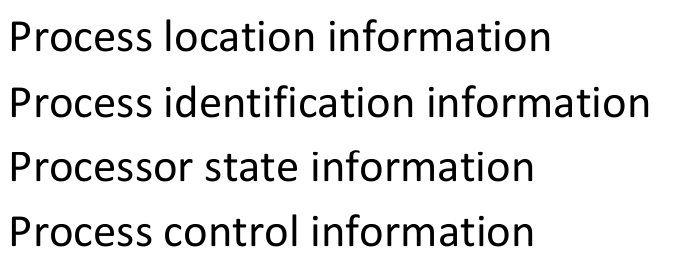
	- 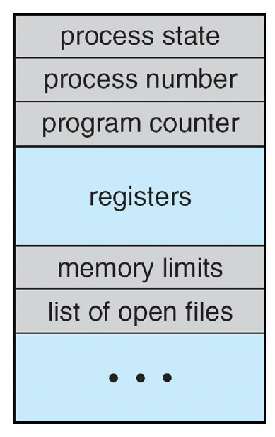
	- 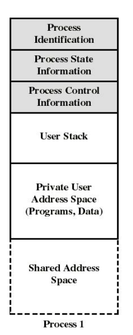
	- The long-term scheduler controls the degree of multiprogramming
	- Medium-term scheduler can be added if degree of
	  multiple programming needs to decrease
	- waitpid() abort() execv() fork() exit() getpid()
	- init parent of all
	- Reaping is performed by parent on terminated child
	  – Parent is given exit status information and kernel then deletes zombie
	  child process
	- Two models of IPC (blocking & non-blocking)
	  – Shared memory
	  – Message passing (message queue) (send(p), receieve(P))
	- 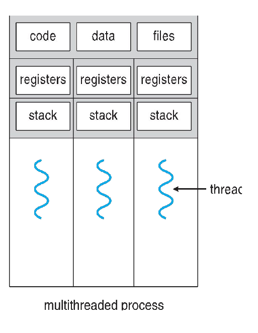
	- Amadhl Law
		- 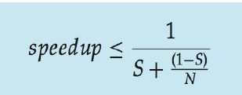
		- S is serial portion
		  N processing cores
	- Two level : M:M 1:1 Kernel:User thread
	- Thread cancellation : async & deferred cancellation
	- Thread Level Storage : share data sections
	- SJF is optimal – gives minimum average waiting time for
	  a given set of processes
	- robin response
	- multilevel foreground – RR
	  – background – FCFS