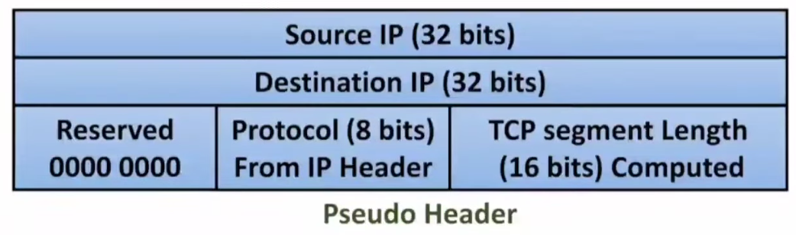
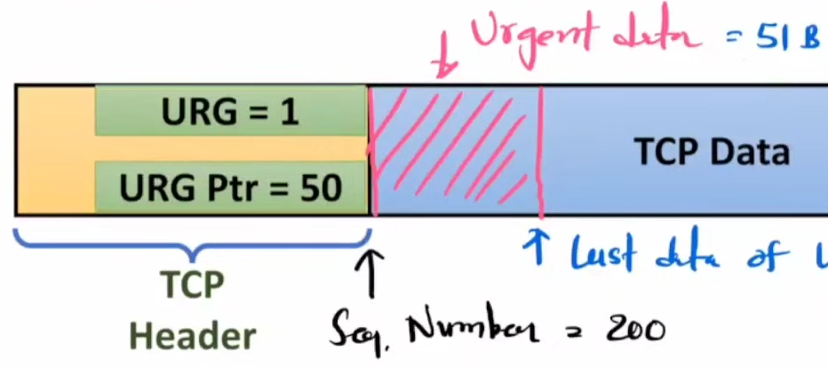

# #[[Before Midsems - Computer Networks]]
- ## TCP [contd]
  id:: 662e405d-9b2e-4f8a-8675-08cb35d52022
	- ### TCP Header
		- #### Sequence No. (32 bits)
			- ID of first byte of segment
			- Sent from source sending the data
			- ##### Random Sequence No. at start
				- To avoid a packet to be misinterpreted as newer packet after process restart.
				- Like non-received packet(seq no=200) be misinterpreted as newer packet(seq no=200) after immediate process restart.
			- ##### Wrap around sequence no.
				- Wrapping(101 -> 1) sequence no. else max possible data is 2^32 - 1 = around 4 GB.
				- Wrap around time : Time to send 4GB of data in TCP (time after which seq no starts repeating)
					- Wrap around Time = Max Data(4 GB) / Bandwidth
				- Life time : Max time for which a packet is present in the network (generally 180s)
				- Wrap Around Time > Life time else issue in transmission (Older 0th seq no. get interpreted in newer wrapped context)
				- To fix this, we add option field as timestamp(8 bit) with sequence no., hence total data and hence wrap around time increases automatically
		- #### Acknowledgement No.
			- Which next seq no. packet to expect
			- It is _received_ Sequence no + "TCP" Data Size + 1
				- TCP Data Size = IP Packet Size - IP Header - TCP Header as TCP data length is not in headers
			- Sent from sink receiving the data
		- #### Header Length (Data Offset)
			- Header Length = 4 * Binary value of data offset (Min = 20B Max = 60B)
		- #### Checksum
			- Using CRC
			- TCP Header[Checksum all bits 0] + TCP Data + Pseudo Header
			- 
		- ((662a439b-d867-4150-861e-f7952102946b))
		- ### Flags
			- #### PSH
				- Push data without filling maximum segment size
				- For realtime apps
			- #### URG and Urgent Pointer
				- Data forwarding out of order to send data urgently (Max Value = 7)
				- {:height 235, :width 501}
			- #### RST
				- To reestablish the connection due to system reboot or unreliable sequence no.(seq no. is out of current window buffer range)
		- #### Options
			- If Window size > 2^16 (Window Field) then extra data is put in option field.
	- ### Flow control
		- Control transfer speed
			- Window Scaling
			- Advertisement Window Size
			- Persistent Timer
		-