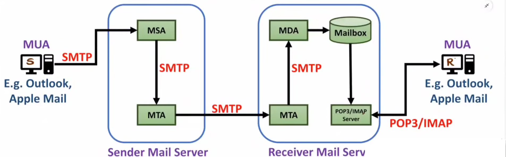

# #[[Before Midsems - Computer Networks]]
- ## TCP [contd]
  id:: 662e405d-9b2e-4f8a-8675-08cb35d52022
	- ### TCP Header
		- Byte stream not message stream (multiple messages sent in continuation)
		- #### Sequence No. (32 bits)
			- ID of first byte of segment
			- Sent from source sending the data
			- ##### Random Sequence No. at start
				- To avoid a packet to be misinterpreted as newer packet after process restart.
				- Like non-received packet(seq no=200) be misinterpreted as newer packet(seq no=200) after immediate process restart.
			- ##### Wrap around sequence no.
				- Wrapping(101 -> 1) sequence no. else max possible data is 2^32 - 1 = around 4 GB.
				- Wrap around time : Time to send 4GB of data in TCP (time after which seq no starts repeating)
					- Wrap around Time = Max Data(4 GB) / Bandwidth
				- Life time : Max time for which a packet is present in the network (generally 180s)
				- Wrap Around Time > Life time else issue in transmission (Older 0th seq no. get interpreted in newer wrapped context)
				- To fix this, we add option field as timestamp(8 bit) with sequence no., hence total data and hence wrap around time increases automatically
		- #### Acknowledgement No.
			- Which next seq no. packet to expect
			- It is _received_ Sequence no + "TCP" Data Size + 1
				- TCP Data Size = IP Packet Size - IP Header - TCP Header as TCP data length is not in headers
			- Sent from sink receiving the data
		- #### Header Length (Data Offset)
			- Header Length = 4 * Binary value of data offset (Min = 20B Max = 60B)
		- #### Checksum
			- Using CRC
			- TCP Header[Checksum all bits 0] + TCP Data + Pseudo Header
			- {:height 221, :width 719}
		- ((662a439b-d867-4150-861e-f7952102946b))
		- ### Flags
			- #### PSH
				- Push data without filling maximum segment size
				- For realtime apps
			- #### URG and Urgent Pointer
				- Data forwarding out of order to send data urgently (Max Value = 7)
				- {:height 235, :width 501}
			- #### RST
				- To reestablish the connection due to system reboot or unreliable sequence no.(seq no. is out of current window buffer range)
		- #### Options
			- If Window size > 2^16 (Window Field) then extra data is put in option field.
	- ### Flow control
		- Control transfer speed
			- Window Scaling
				- Common Window size in during connection establishment in TCP
			- Advertisement Window Size
				- During transmission of data, receiver will advertise its window size to sender continuously to prevent over transmission in case of full buffer.
			- Persistent Timer
				- After some persistant time, sender can send PROBE frame to receiver to check if its buffer is still full or has empty space, to restart transmitting data.
			- {:height 386, :width 498}
	- ### Sliding Window Protocol
		- #### Hybrid Sliding Window Protocol
			- ##### Selective Repeat
				- Sender Window(Contention Window CWND) Size = Receiver Window Size
				- Accepts out of order segment (waiting for seq=101, but can accept 150th too if window size allows)
			- ##### Go Back N
				- Sending acummulative acknowledgements, of multiple packets at once.
				- If one fails, then send all again!
	- ### Retransmission in TCP
		- #### Timeout based
			- Resend packet after timeout if ACK not received for it.
		- #### Dupack or Early retransmission
			- Before transmission, on receiving _three duplicate_ ACK for a segment
	- ### Congestion Control
		- Open(transmitter not informed about congestion) / Closed(transmitter informed)
			- Open -> Policy of Re-transmission,Window, ACK, discard (non-needed packets) and admission(check resource before admitting to network, check before send)
			- Closed -> Back pressure(router informs (in chain of previous router to sender) sender), choke packet(using ICMP to stop transmission), implicit signalling, explicit signalling
				- {:height 301, :width 335}
		- Network Layer - ICMP (Router to Router)
		- Transport Layer - TCP (Entire end to end network)
		- By scaling window size (lower Window size lesser the data transferred)
		- Wth = CWND/2
		- Stages
			- Slow start phase
			  logseq.order-list-type:: number
				- _Congestion Window(Wc)_ = 1 or 2 initially and will grow by _x_ 2 till threshold(=CWND/2)
			- Congestion Avoidance phase
			  logseq.order-list-type:: number
				- Congestion Window increase by _+_ 1, if no congestion
			- Continuously Congestion detection phase
			  logseq.order-list-type:: number
				- Timeouts (Severe congestion)
				  logseq.order-list-type:: number
					- _Wth(threshold value)_ = Wc/2 and slow start
					- Wc = 1
				- 3 Duapack (Mild congestion)
				  logseq.order-list-type:: number
					- Wth = Wc/2 and congestion avoidance
					- Wc = Wth
			- {:height 276, :width 528}
				- Wth = Wr / 2 = 64 / 2 = 32
				- Roundtrip time to reach Wr = log2 (Wth) + 1 + Wth
				- {:height 332, :width 464}
			- After SYN, Window Size(sender) = min (Receiver Window Size, Wc)
	- ### Timers
		- #### Time-wait timers
			- Delayed segments received by the receiver
		- #### Persistent Timer
			- Stop sending data for fixed time after receiver window is full
		- #### Keep Aliver Timer
			- Close Idle connection, server sent probe frames after keep alive time to check if client is idle or not
		- #### Acknowledgement Timer
			- Sends cummulative ACK of all packets after ACK timer times out!
		- #### Timeout Timer
			- For retransmission of data after timeout if its ACK is not received
			- Based dynamically on network params like traffic, bandwidth etc
			- ##### Basic Algortihm for Timeout timers
				- Assume Initial Round Trip Time (IRTT)
				  logseq.order-list-type:: number
				- Timeout Timer $$T_o$$ = 2 IRTT
				  logseq.order-list-type:: number
				- Observe Actual Round Trip Time (ARTT)
				  logseq.order-list-type:: number
					- New Round Trip Time (NRTT) = \alpha IRTT + (1- \alpha) ARTT
					  logseq.order-list-type:: number
					- \alpha is smoothing factor
					  logseq.order-list-type:: number
					- $T_o$ = 2 NRTT
					  logseq.order-list-type:: number
					- IRTT = NRTT of previous segment 
					  logseq.order-list-type:: number
	- ### Silly Window Syndrome
		- Due to ineffective utilization of resources
			- Window size is full : Reset the connection, as bandwidth wasted till persistent timer
			- Slower Sender : When Sender is sending in very small chunks. Wait for Round Trip Time(RTT) as per **Naggle's Algo** for more data accumulation.
			- Slower Receiver : Receiver is unable free window buffer at faster pace and hence smaller chunks from sender. Use **clark's soln** which says to don't send ACK till MSS or 0.5 buffer size is free.
	- ### Congestion Control
		- #### Traffic Shaping
			- Make Rate of data transfer constant
			- Data rate negotiation is done at connection initiation using Option Field
		- #### Leaky Bucket
			- Add data to buffer at any rate(from application layer), but output at constant rate only!
			- Waste of bandwidth if no data.
			- If overflow then discard!
			- Uses average operating flow
		- #### Token Bucket
			- Same as Leaky Bucket, but add token even if no data inflow happen!
			- Buffer Capacity C > Tokens in Bucket
			- Max no. of packets in sec = C + rt
			- Max average rate = (C + rt)/t
			- {:height 329, :width 276}
			- Data is pushed equal to the Buffer Capacity out of the bucket
			- {:height 164, :width 498}
	- $Bandwidth = Data /{Round\ trip\ time}$
	- ### Quality of Service
		- Reliability, Delay, Jitter(variation in delay), Bandwidth
		- Fix
			- Scheduling Algo
			- Traffic shaping (Token bucket, Leaky bucket)
			- Admission control (accept if resource are available)
			- Reserve reservation (resources are already reserved for upcoming packet)
		- {:height 307, :width 342}
		- {:height 271, :width 477}
		-
- ## UDP
	- ((662a439b-7ccd-4755-8b35-6b5bae6899ed))
- ## Mobile IP
	- Allow change between network w/o changing IP with security (auth)
	- Mobile Node (MN) {end user} ---> Correspondent Node (CN)
	- Care of Address (COA)
	- Home network (HN): MN is designated to this
	- Foreign network: MN changes to this when network changes
	- Foreign Agent COA : Provides services to MN during its visit
		- Forwards packet to MN & provides security
		- Implemented on router
	- Co-located COA : MN acquire temp IP, which is co-located COA
	- Home agent (HA): Located in Home N/W. Tunnel for packet at MN starts at this and has location registry(MN's location)
	- Tunnel : path taken by encapsulated packets
	- {:height 264, :width 594}
	- Steps
		- Registration (UDP)
		- Discovery (ICMP) : Finding foreign agent
			- Agent Advertisement
			- Agent solicitation
			- 
	-
	-
	-
- # Application Layer
	- ## DNS
		- Store IP, domain name & Validity/TTL (time to live)
		- UDP Protocol
		- Domain name - Generic name(com, org) & Country domain
		- Root Domain(.) -> Top level Domain -> Second level Domain -> Subdomain
		- Root DNS -> Name Server (TLDs) -> Host Server
		- Address Resolution
			- Iterative : First hit Root DNS, then get the Name Server and hit it and similarly Host Server
			- Recursive : Same as Itertive, but instead of client hitting the next the Root hits the Name server and name server hits the host server in recursive fashion
	- ## SMTP, POP, IMAP
		- 
		- MSA : Mail Submission Agent ; MTA = Transfer ; MDA = Delivery
		- POP deletes the message from the mailbox after sending it to user, while IMAP doesn't
		- POP : stateful
		- 
	- ## HTTP/HTTPS
		- Usually TCP; Port 80
		- Server stateless; Client stateful (using cookie to know about server etc)
		- In band Protocol : Command and Data on same connection
		- Types of HTTP
			- HTTP 1.0
				- Non persistent connection; for each request response transaction a TCP connection is established
				- Simple, predictible resource usage, high overhead and latency
			- HTTP 1.1
				- Persistent connection; TCP connection is not closed after connection is ended.
		- ### HTTP Methods
			- GET
			- HEAD : GET for headers
			- POST : fill forms
			- PUT : upload objects/files
			- DELETE : delete object/files
			- CONNECT : Used by HTTPS to secure connection
			- OPTIONS : To query available communication options for a URL
			- TRACE : See intermediate nodes interpreting the request
			- PATCH : Apply partial modification to resource
	- ## FTP, SPTF & TFTP
		- ### FTP (port 21)
			- Two channel - Data & Commands (Out of band protocol)
			- TCP; auth; no encryption; stateful
		- ### SFTP - SSH FTP (port 22)
			- Single channel for data & commands (In Band protocol)
			- TCP; auth; encrypted
		- ### TFTP - Trivial FTP (port 69)
			- UDP; no auth; not internet but LAN tranfers
		- {:height 281, :width 291}
			- PASV for initiation/auth
		-
			-
		-
		-