## Random Variable
	- Random Variable = Real Number to each sample point
	- Probability Distribution = Random Variable + Its Probability
	- ### Discete
		- P(x) >= 0
		- \Sigma P(x) = 1
		- Mean \epsilon (x) = \Sigma x P(x)
		- Binomial
		- Possion
		- ### Probability Mass Function (PMF)
			- Pi >= 0
			- \Sigma Pi = 1
		- ### Distribution Function
			- Cumulative form of PMF
			- f(x) = {1/8 x <=0; 2/8 x <=1; ........ }
			- 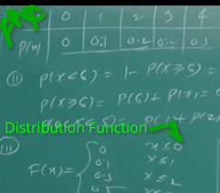
			-
	- ### Continuous
		- f(x) >= 0
		- $\int_{-\infty}^{\infty}f\left(x\right)\mathrm{d}x=1$
		- Mean \epsilon(x) = $\int_{-\infty}^{\infty}xf\left(x\right)\mathrm{d}x$
		- Exponential
		- Normal
		- Uniform
		- ### Probability Density Function (PDF)
			- Similar to PMF in DIscrete
			- f(x)
		- ### Cummulative Distribution function (CDF)
			- F_{X} (x) = P(X<= x) = $\int_{-\infty}^{x}f\left(x\right)\mathrm{d}x$
			- $\frac{d}{\mathrm{d}x}F\left(x\right)=f\left(x\right)$
- ## Mathematical Expectation E(\Phi(x))
	- Discrete \Sigma \Phi(x) P(x)
	- Continuous $\int_{-\infty}^{\infty}\Phi\left(x\right)f\left(x\right)$
- ## Mean E(x)
	- Var(x) = E(x^2) - (E(x))\^2
- ## Gamma Function
	- $\int_0^{\infty}x^{n-1}e^{-ax}=\frac{\gamma\left(n\right)}{a^{n}}$
	- \gamma(n) = n-1.n-2.......1 (for positive integers n)
	- \gamma(n) = (n-1) \gamma(n-1) (for n>1)
	- \gamma(1/2) = $\sqrt{\pi}$
	- \gamma(3/2) = $\sqrt{\pi}/2$
	- 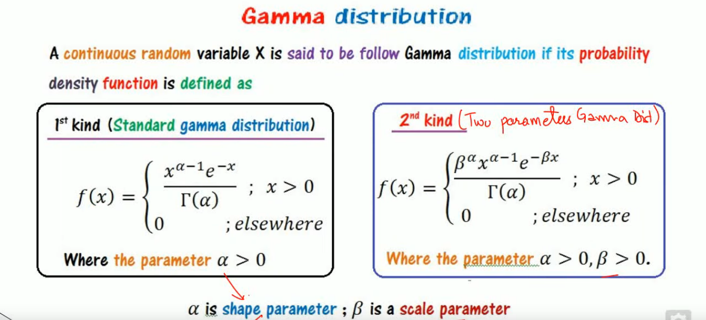
	- 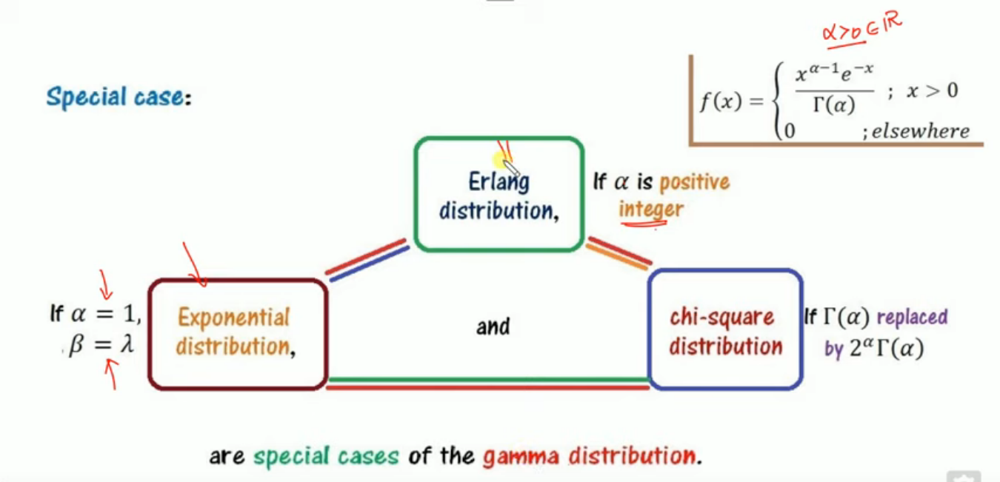
- ## Binomial Distribution
	- All trial are independent, number of trial is finite, probability of success independent of no of trial, probability is high
	- P(x) = ^{n}C_{x} P^{x} q^{n-x}
	- Mean = np
	- Variance = npq
- ## Moment Generating Function M_{x}(t) = E(e^{xt})
	- E(x) = $\frac{d}{\mathrm{d}t}\left(M_{x}\left(t\right)\right)_{t=0}$
	- E(x^{2}) = $\frac{d^{2}}{\mathrm{d}t^{2}}\left(M_{x}\left(t\right)\right)_{t=0}$
	-
- ## Characteristic function \Phi_{x} (t) = E(e^{ixt})
- ## Probability Generating function Z_{x}(t) = E(z^{x})
- ## Standard Error = $\frac{\sigma}{\sqrt{n}}$
- ## Poission Distribution
	- n is very large, probability of event is very less, for discrete only!
	- $P\left(x\right)=\frac{\lambda^{x}e^{-\lambda}}{x!}$ x= 0,1,2..... Poisson Variate
	- Mean = \lambda
	- Variance = \lambda
	- \lambda = np
	- 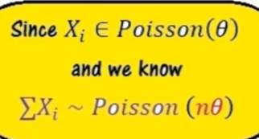
- ## Exponential Distribution
	- $f\left(x\right)=\lambda e^{-\lambda x}$
	- Continuous
	- Mean = 1/\lambda
	- Variance = 1/\lambda^{2}
- ## Normal Distribution
	- Continuous
	- $f\left(x\right)=\frac{1}{\sigma\sqrt{2\pi}}e^{-\frac12\left(\frac{x-\mu}{\sigma}\right)^2}$
	- X ~ N(\mu, \sigma)
	- Mean = E(x) = \mu
	- Variance = \sigma^{2}
	- Standard Normal Variate Z = $\frac{x-\mu}{\sigma}$
	- \Phi(x) = P(Z<x)
	- Moment Generating Function of Standard Normal Variate Z
		- M_{z}(t) = E(e^{zt})
	- ### Area under Curve
		- 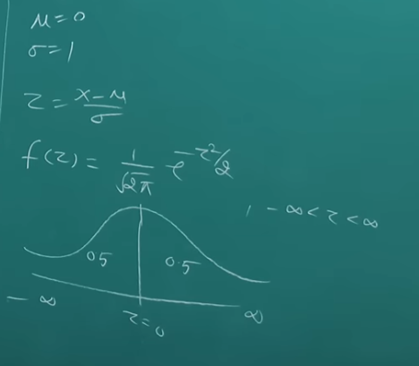
		- Reading Normal Table
			- 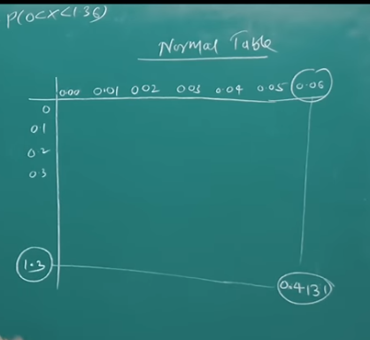
- ## Geometric Distribution
	- Till 1 success
	- 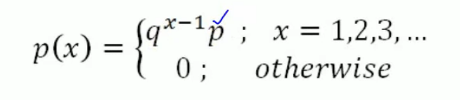
	- 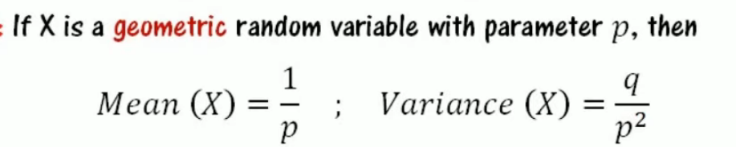
	- 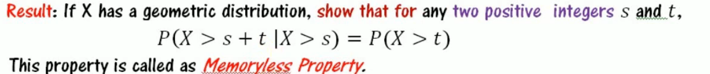
- ## Negative Binomial or Pascal
	- Till n success
	- 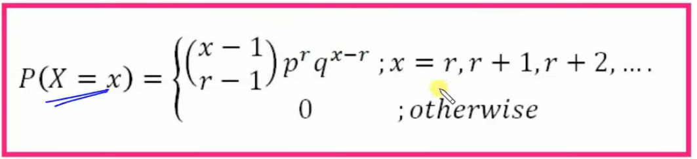
	- 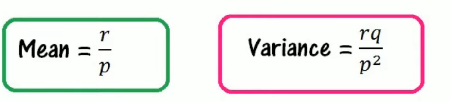
- ## Hyper-geometric Distribution
	- Exact distribution without replacement
	- 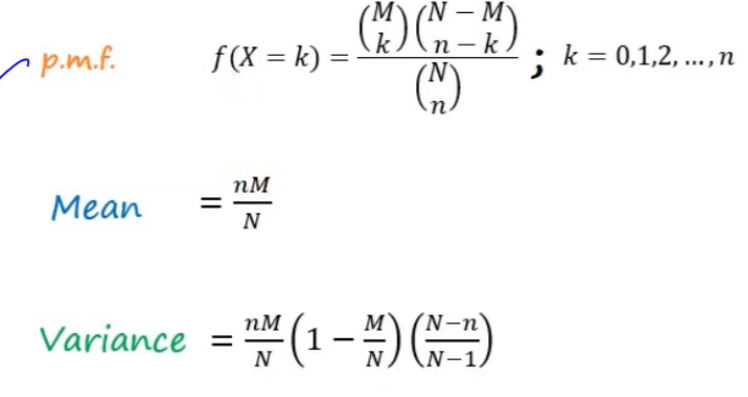
	-
- ## Rectangular or Uniform Distribution
	- Continuous
	- iff over (a,b)
		- f(x) = {k      a<x<B
		            0      0/\omega
		  }
	- f(x) is PDF, hence
		- $\int_{a}^{b}k\mathrm{d}x=1$
		- $k=\frac{1}{b-a}$
	- Mean = $\frac{a+b}{2}$
	- Variance = $\frac{\left(a-b\right)^2}{12}$
- ## Bivariate Random Variable
	- (X, Y) is bivariate or two dimensional random variable
	- ### Discrete
		- ### Joint Probability Mass function of (X,Y)
			- Make Table of X,Y, P_{ij}
			- P(X=x_{i}, Y=y_{i}) = P_{ij} >= 0
			- $\sum_{i=1}^{m}\sum_{j=1}^{n}P_{ij}=1$
		- ### Marginal Probability Mass function of X
			- P(X=x_{i}) = \Sigma P_{ij} = P_{i1} + P_{i2} + ........
			- (x_{i}, P_{i}) is marginal pmf of x
			- Mean(x) = \Sigma P(x_{i})
			- 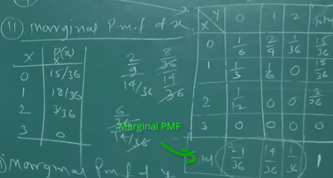
		- ### Conditional Probability Mass function of X
			- P(x/y=j) =
			- 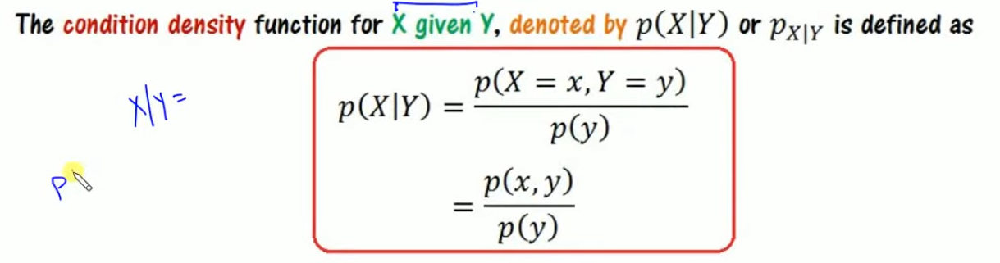
			- 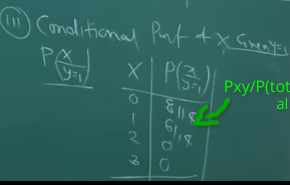
		- If X & Y are independent
			- P_{XY} (x,y) = P_{X}(x) P_{Y}(y)
				- where P_{x} and P_{y} are marginal PMF and P_{XY} are joint PMF
	- ### Continuous
		- F(x,y) = P(X<=x, Y<=y) = $\int_{-\infty}^{x}\int_{-\infty}^{y}f\left(x,y\right)\mathrm{d}y\ dx$
			- Inner integral is took from strip limits, while outer is from entire limits while calculating *Joint Distribution Function*.
		- ### Marginal Density Function
			- $f\left(x\right)=\int f\left(x,y\right)\mathrm{d}y\left(Independent\right)ofy$
			- Same for f(y)
		- ### Conditional Probability Density function
			- f(X|Y) = f(x,y)/f(y)
		- Draw feasible area on graph and then solve
		- 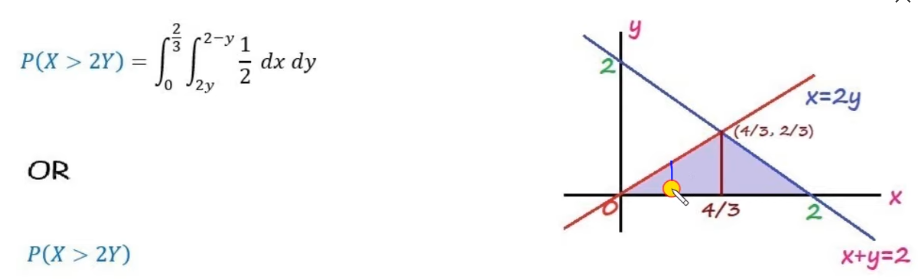
	- ### Transformation of Discrete Random Variable (find PDF of Y=g(x)
		- Convert from X PDF to Y PDF
		- One to one => Replace as is in the new function
		- Many to one => Add all occurrence in one and then display
	- ### Transformation of Continuous Random Variable
		- Must be continuously differentiable, monotonous, f(x) != 0
		- Then PDF of Y = v(X) is
			- $g\left(y\right)=f\left(x\left(y\right)\right)\left|\frac{\mathrm{d}x}{\mathrm{d}y}\right|$
				- x(y) means replace with x=j(y) in f(x)
			- 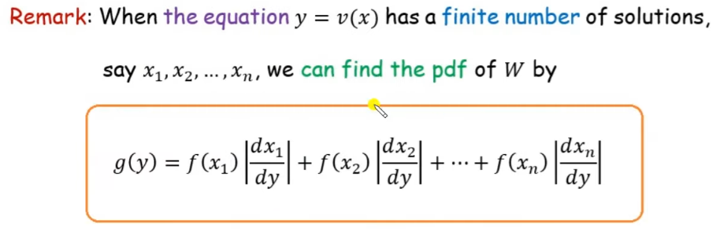
	- Transformation of 2D Random Variables
		- 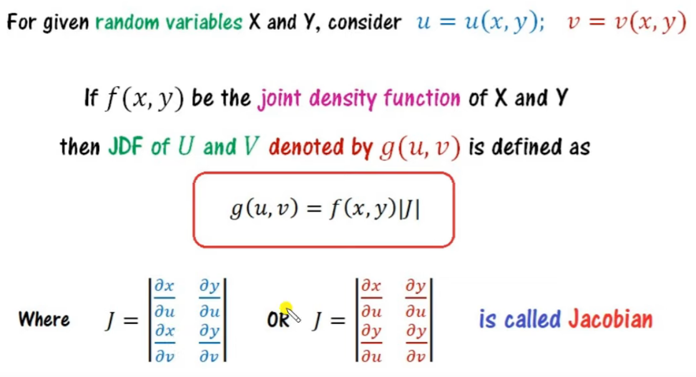
		- 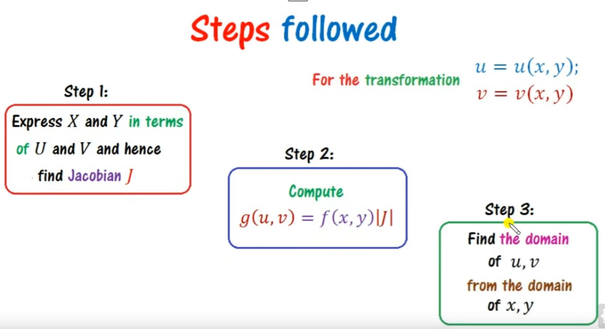
- ## Chi Square Distribution
	- Degree of freedom = n -1
	- Mean = n
	- Variance = 2n
- ## Central Limit Theorem
	- 
	- 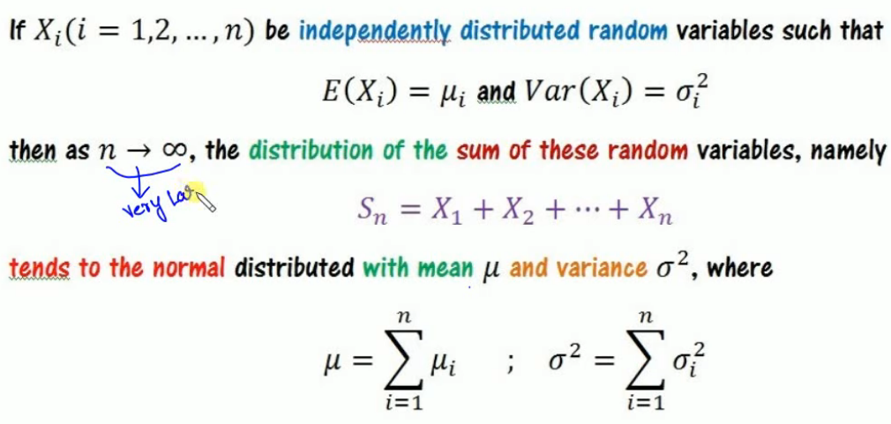
	- 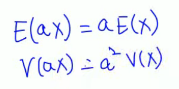
	- 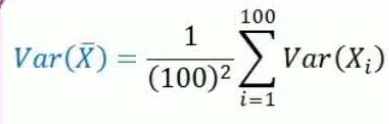
	- 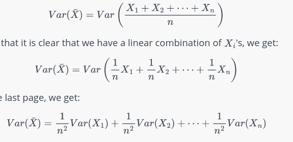
	- 
	- 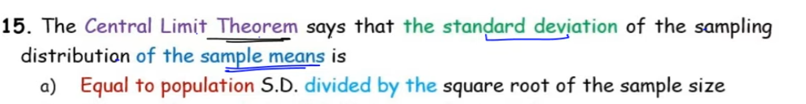
	- 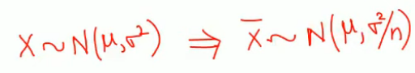
- ## Chebyshev's Inequality
	- 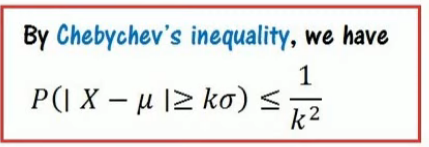
	- 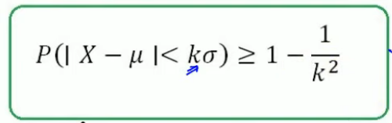
	-
- ## Covariance \sigma_{XY}
	- 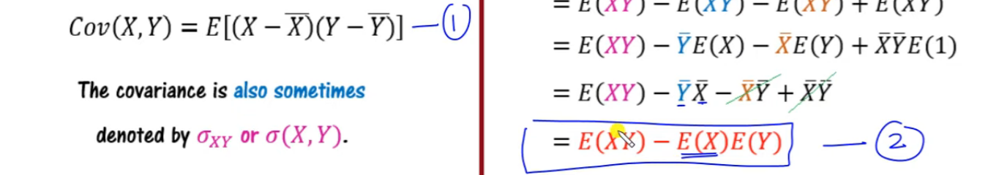
	- 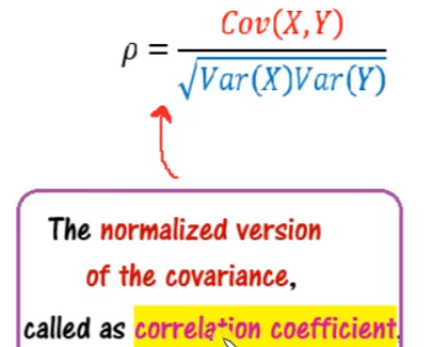
	- 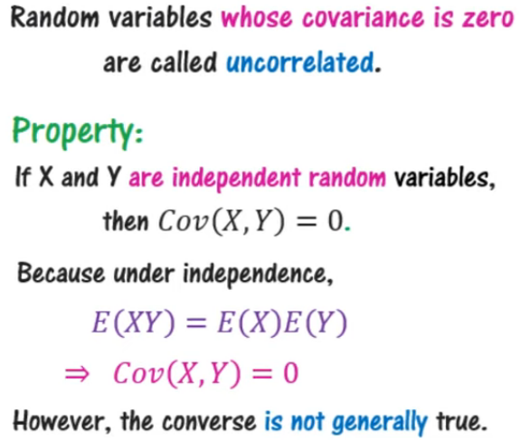
	- 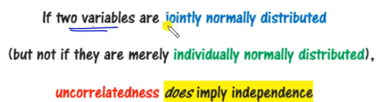
	- 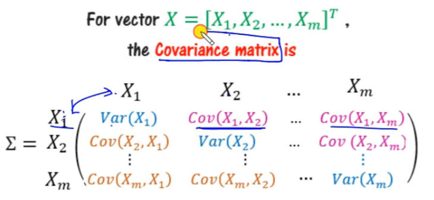
	- 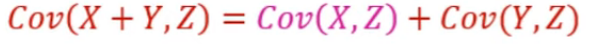
	- 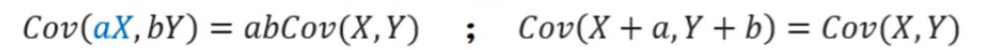
	- 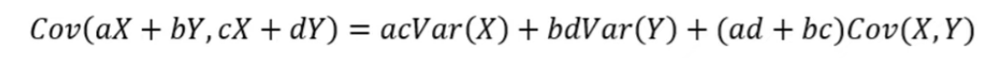
	- 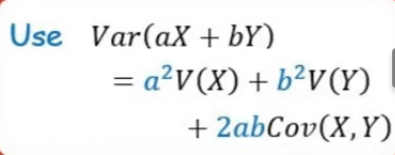
- ## Estimator
	- 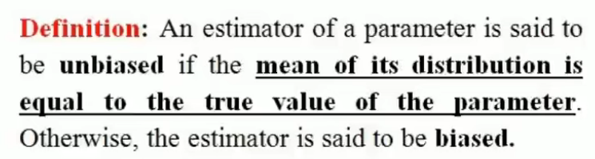
	- 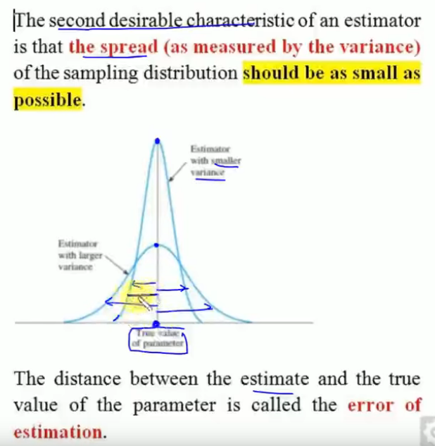
	- 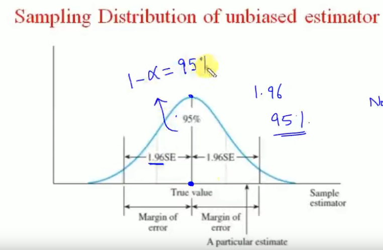
	- 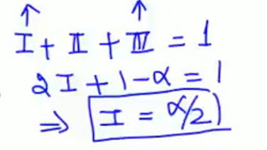
	- 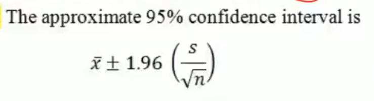
	- 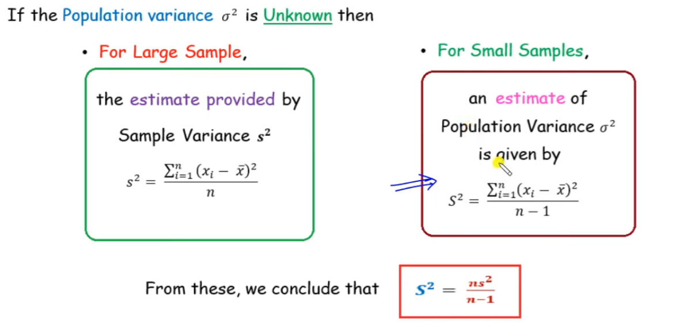
	- ### Consistency Estimator
		- 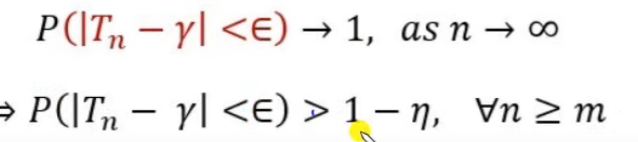
		- T_{n} is the sample property, while \gamma is the population property
		- 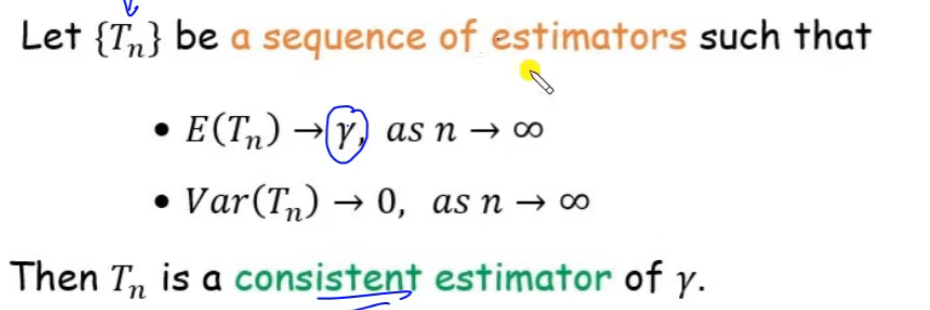
	- ### Cramer's Rao inequality
		- 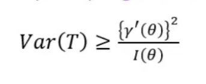
		- 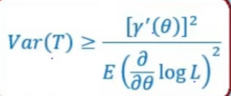
	- ## Minimum Variance Bound (MVB)
		- 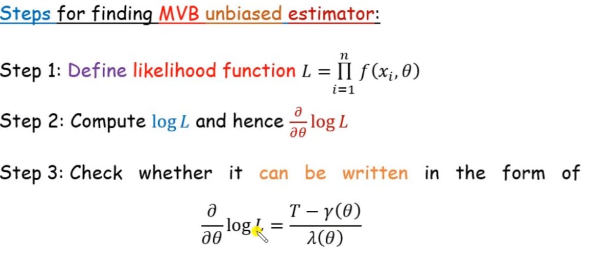
	- ## Maximum Likelihood Estimation (MLE)
		- find $\frac{d}{d\theta}f\left(x,\theta\right)=0$ and find MLE from \theta (find likelihood & differentiate)
		- Discrete : find max manually
	- ## Method of Moments
		- 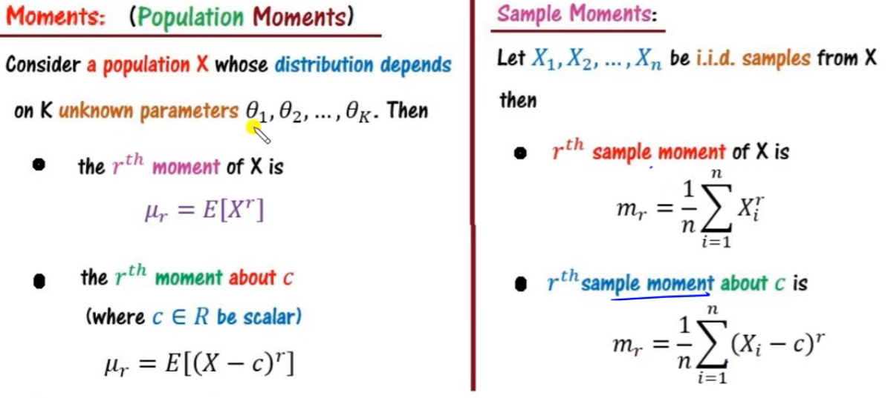
		- Equate population and sample moments
		- No of Variables equals to number of equations
- ## Hypothesis
	- ### Null
		- Equals H_{0}
	- ### Alternate
		- Not equal H_{1}
	- ### Simple
		- Uniquely determined (all constant and same in the hypothesis)
	- ### Composite
		- Not simple
	- ### Type I and II error
		- 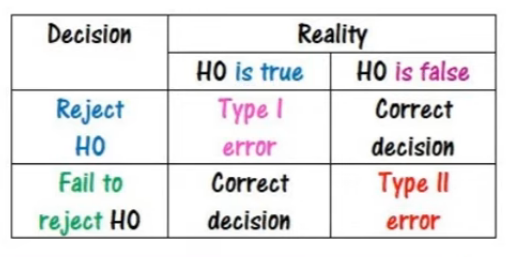
		- 
		- Level of significance = \alpha
		- Power of test = 1 - \beta
		- 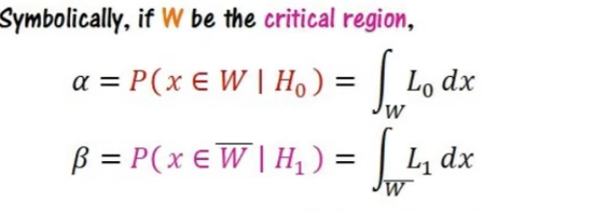
	- ### Most Powerful Tests
		- 
		- ### Neyman-Pearson Lemma
			- 
			- 
- ## Concept of Confidence
	- 
	-