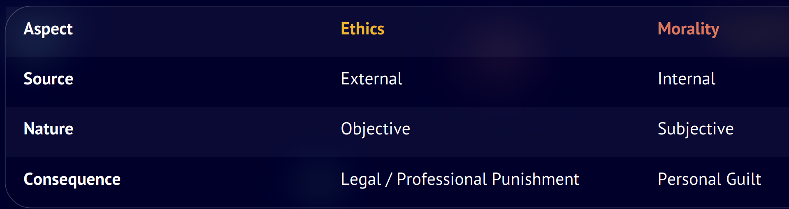
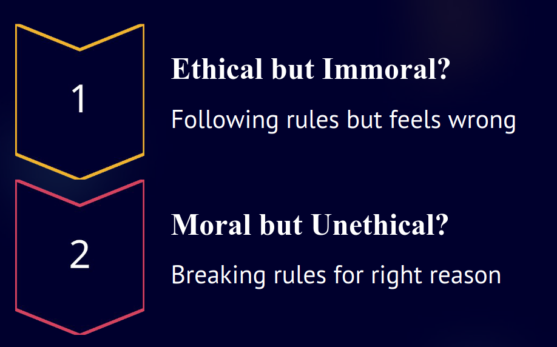
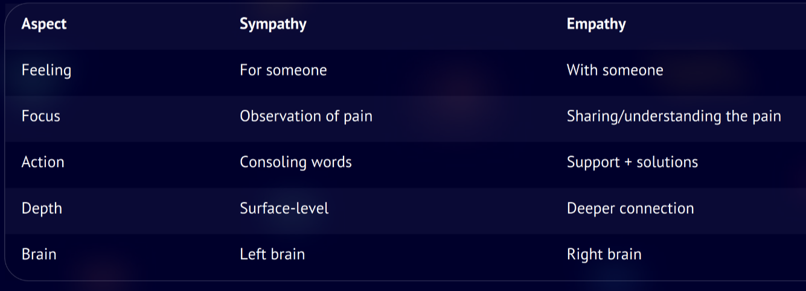
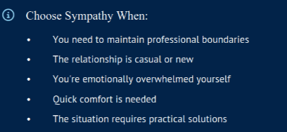
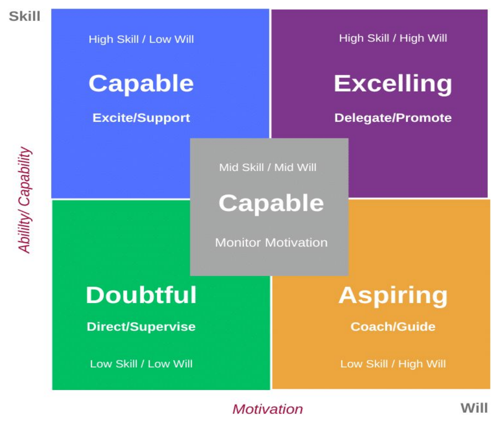
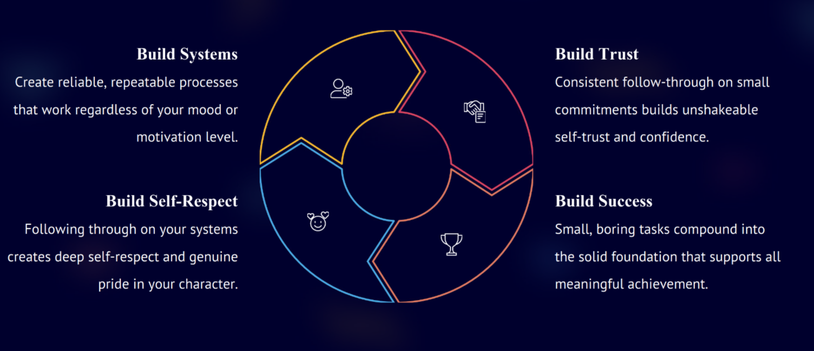

## Ethics vs Morality
	- Ethics(External Rulebook): The formal codes and regulations that govern our professional and social conduct.
	- Morality(Internal Rulebook): The personal values and principles that guide our individual sense of right and wrong.
	- {:height 150, :width 539}
	- {:height 320, :width 502}
- ## Sympathy vs Empathy
	- Left -> Sympathy; Right -> Empathy
	- Sympathy: Acknowledge, but maintain emotional distance, offer comfort
	- Empathy: Stepping into another's shoes and experiencing their emotions alongside them
		- You create a bridge of understanding, sharing in both the emotional weight and the journey towards healing.
		- Requires vulnerability and emotional courage
	- Engineer: Better Teamwork, Improved Communication(complex idea to diverse audience), User-Centred Design & Product Development(Sym - Recognize, Emp - Feel)
	- 
	- 
	- Understanding: Connection, Compassion, Support, Growth, Balance
- ## Hormones
	- Cortisol, Dopamine(control instant rewards), Testosterone(Confidence & Focus; gym diet), Oxytocin, Serotonin
	- Dopamine is about the chase, not the catch. Master the chase, master your motivation.
	- Oxytocin
		- Touch, Connection, Eye contact, Acts of service, Gratitude
	- Serotonin
		- Faith, Social Skill
		- Mood, sleep, digestion, and self-worth
		- Sunlight, celebrate wins, Gratitude
- ## Goal vs System
	- {:height 407, :width 464}
	- Goal
		- Motivation Fades, Missing Systems, Goals Collapse
	- System
		- Small Habits Create Big Change, Systems Work(restart), Daily Rhythm
		- Design for Chaos, Start Ridiculously Small
		- Make It Routine, Set Reminder, Chase Religiously, Plann / Do / Check / Act
		- Patterns Create Calm, Pressure Creates Chaos, fatigue
		- Systems Create Self-Trust
		- Discipline Equals Kindness
		- {:height 245, :width 537}
- ## Integrity, Honesty, Probity
	- Probity: Incorruptibility and uprightness in public life
	- Integrity: Adherence to moral & ethical principles even when unobserved
- ## Responsibility vs Accountability
	- Responsibility: Task-focused and action-oriented; The duty to complete a task or role
	- Accountability: Outcome-focused and results-oriented; The obligation to answer for the outcome; ultimately held by one person
	- Deal with Free rider & Jealousy
		- Segregate
		- Problem Assessment
		- Sympathy & Empathy
		- Disciplinary action
	- 4P: Purpose, Passion, Potential, Preference
	- Accountability: Pay Attention to Details, Acknowledge Mistakes Openly, Accept feedback, support colleagues