- Source: https://www.youtube.com/playlist?list=PLloZa6L2Dthi-baGngFkImaq3jJEPQm6l
- ### Introduction
	- Prob of current state/reward only depend on last state and action
	- Best suited for Episodic tasks: series of tasks
	- {:height 345, :width 344}
	- Agent: Who takes Action(A)
	- Action: Agent that takes in given state in env. Discrete possible actions(a)
	- State: Configuration of surrounding in which agent find itself
	- Reward(r): Immediate feedback given by env
	- Environment: Action, State -> Reward, Next State
	- Trajectory: sequence of state/actions
	- Discount factor(\gamma):
		- To make future reward worth less than immediate reward
		- {:height 81, :width 476}
	- Policy(\pi)
		- Strategy based on current state
	- State Value Function(V):
		- Cumulative discounted reward if start in state s at t=0, follow policy \pi
		- 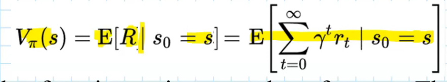{:height 90, :width 451}
	- Action Value Function(Q)
		- Cumulative discounted reward if start in state s at t=0, and take action a and follow \pi
		- In action value, $a_0$ is not taken as per policy \pi
		- 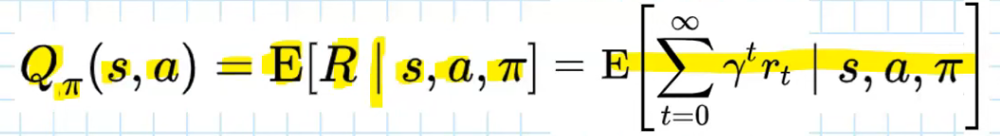{:height 72, :width 456}
- ## Markov Process
	- Process: Sequence of states and action taken
		- Discrete Time Process
		- Stochastic Process (state/actions are determined randomly)
	- ### Discrete Time Markov Process
		- For discrete time, stochastic process (future only depends on present)
		- 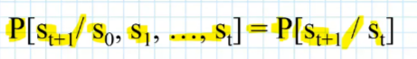
		- One Step Transition Probability
			- matrix M
				- 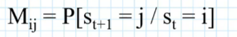
				- i,j = state
			- St for row, St+1 for column
- ## Markov Decision Process
	- MDP is Markov Process, where states are partly random and other in under control of agent(decision maker)
	- 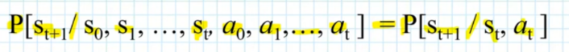{:height 61, :width 419}
	- If we follow a policy $$a_t = \pi(s_t)$$
		- 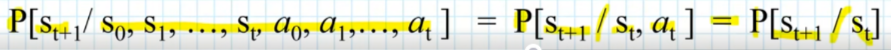
	- 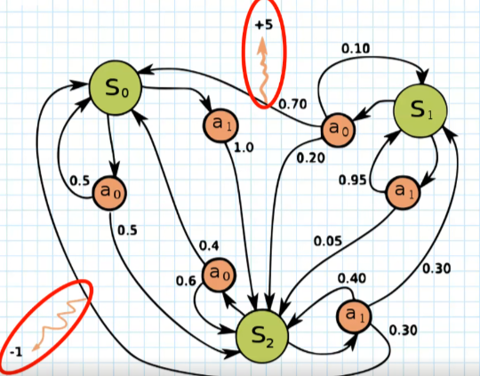{:height 319, :width 365}
	- 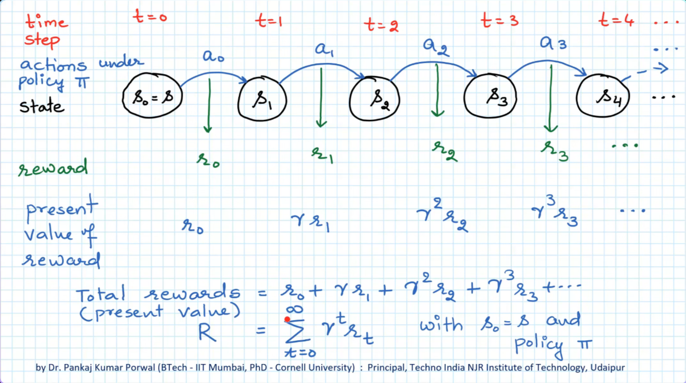{:height 240, :width 424}
	- 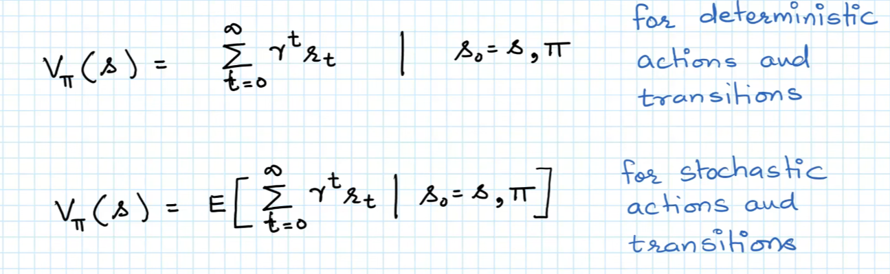{:height 136, :width 415}
	- 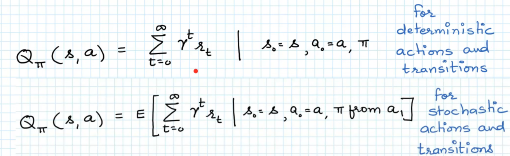{:height 137, :width 406}
- ## Bellman Equation
	- 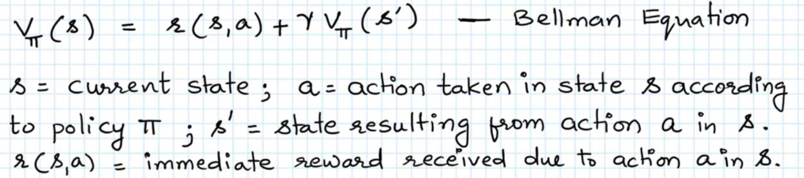{:height 138, :width 610}
	- feasible for finite, small no. of states
	- ### Bellman Principle of Optimality
		- Given state, optimal policy only depends on future action/state, not past ones.
		- We do backtracking
		- 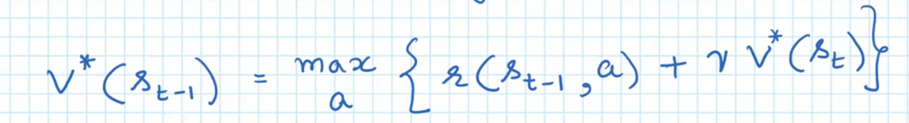{:height 89, :width 579}
			- Optimal Value at final state is 0
- ### Model Based RL algo
	- Assume model of the environment as MDS (all state, reward, T etc)
	- Transition Probability: T(s,a,s')
	- Reward function: r(s,a,s')
	- Approach
		- Value Iteration
			- Choose action that maximizes optimal state value function
			- 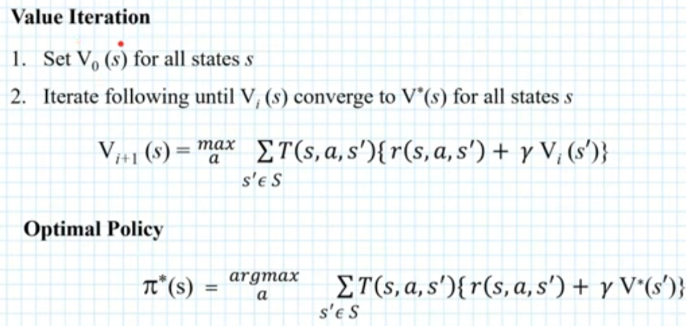{:height 209, :width 416}
		- Policy Iteration
			- Better estimate of optimal policy iteratively
			- Policy eval: calculate state value function
			- Policy improvement: policy function is improved, by selecting action that maximizes reward
			- 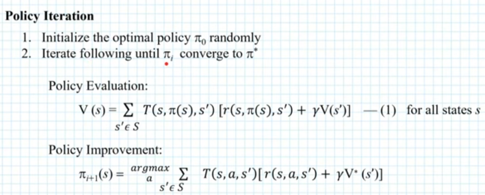{:height 263, :width 628}
		-
- ### Monte Carlo Method
	- Repeated sampling and probability
	- Steps
		- Policy evaluation
		  logseq.order-list-type:: number
			- estimate Q value by averaging sample return over time
		- Policy improvement
		  logseq.order-list-type:: number
			- greedy over Q, return s that maximize Q(s,a)
	- 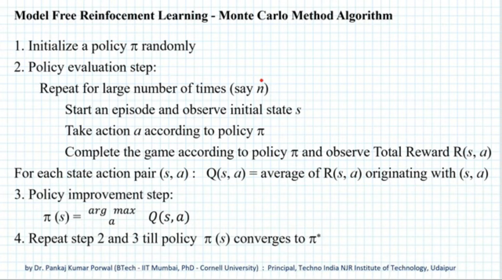{:height 303, :width 527}
	- Feasible for games for small no. of state, actions, step
	- works only for episodic problems
	- \epsilon Greedy Policy
		- Exporation = \epsilon
		- Partial Knowledge = 1 - \epsilon
		- start with \epsilon -> 1, and bring it closer to 0, when we learn more about env
		- 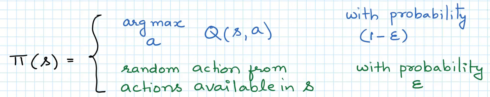
	-