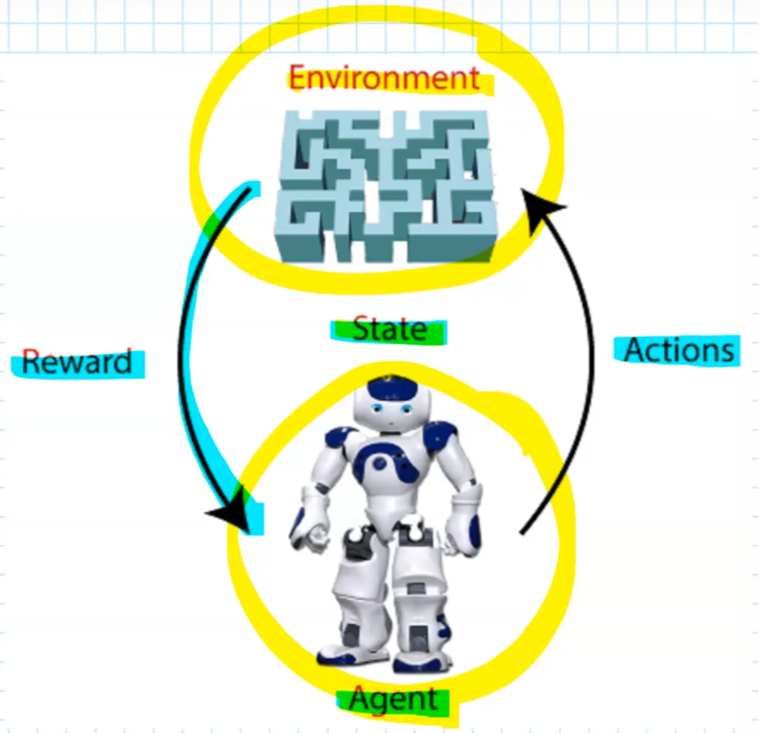

- Source: https://www.youtube.com/playlist?list=PLloZa6L2Dthi-baGngFkImaq3jJEPQm6l
- ### Introduction
	- Prob of current state/reward only depend on last state and action
	- Best suited for Episodic tasks: series of tasks
	- {:height 345, :width 344}
	- Agent: Who takes Action(A)
	- Action: Agent that takes in given state in env. Discrete possible actions(a)
	- State: Configuration of surrounding in which agent find itself
	- Reward(r): Immediate feedback given by env
	- Environment: Action, State -> Reward, Next State
	- Trajectory: sequence of state/actions
	- Discount factor(\gamma):
		- To make future reward worth less than immediate reward
		- {:height 81, :width 476}
	- Policy(\pi)
		- Strategy based on current state
	- State Value Function(V):
		- Cumulative discounted reward if start in state s at t=0, follow policy \pi
		- {:height 90, :width 451}
	- Action Value Function(Q)
		- Cumulative discounted reward if start in state s at t=0, and take action a and follow \pi
		- In action value, $a_0$ is not taken as per policy \pi
		- {:height 72, :width 456}
- ## Markov Process
	- Process: Sequence of states and action taken
		- Discrete Time Process
		- Stochastic Process (state/actions are determined randomly)
	- ### Discrete Time Markov Process
		- For discrete time, stochastic process (future only depends on present)
		- 
		- One Step Transition Probability
			- matrix M
				- 
				- i,j = state
			- St for row, St+1 for column
- ## Markov Decision Process
	- MDP is Markov Process, where states are partly random and other in under control of agent(decision maker)
	- {:height 61, :width 419}
	- If we follow a policy $$a_t = \pi(s_t)$$
		- 
	- {:height 319, :width 365}
	- {:height 407, :width 712}
	- {:height 183, :width 572}
	- {:height 176, :width 536}
- ## Bellman Equation
	- {:height 138, :width 610}
	-
-
-
-
-