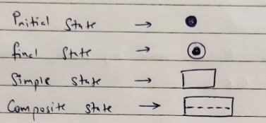

- DR = (defect/LOC) * time
- DRE = (E/E+D) * 100
- Lehman Model          M = P + ke^(c-d)
- Bochm Model
	- AME(Annual Maintainancce) = ACT(Annual Change Traffic) * SDE * EAF
	- ACT = Kloc(add-delete/total) in one year
- Risk - Uncertainity (Negligible, Marginal, Critical, Catastrophic)
- RMMM - Proactive(Predictive) Reactive
- Types - Project(t & $), Technical, Buisness, Predictive, Unpredictible
- Risk Components - Cost Performance Schedule Support
- Risk Exposure = Probability * Cost
- Requirement Enginering
	- Management - Change,Version control, req status tracking, req tracing
	- Engineering - Elicitation(Core, IBIS, FODA, QFD, JAB, Procedure), Analysis, Specification(Control & Process), Validation
- ## Analysis
	- Data/Object/Content(ER)
	- Functional or Information(Data flow level 0 1 2)
	- Dynamic or Behavioral(State Transition) - interfaces
- Design
	- Abstraction
	- Refinement (Complex to Simple Units)
	- Modularity (Dev and Integration Cost)
	- Architecture (Blueprint, minimal impl overheads)
	- Control Hierarchy (Depth, Width, Fan in, Fan out)
	- Structural Positioning (Order, Horizontal, Vertical)
	- Data Structure
	- Software Procedure (Process definition language [flowcharts, pseudocode, algo])
	- Information Hiding (Cohesion factor)
- Structural Testing
	- Basic Path Testing (Flow Graph => Cyclomatic Complexity)
		- V(G) = E - N + 2P P=No of Graph
		- V(G) = No of Regions
		- V(G) = P + 1 (P=Predicate Node, No of out edge - 1, >= 2 edge from source)
		- Graph matrix (row = node, col = connecting node)
		- Connection matrix (weights of 1 instead of label)
	- Control Structure Testing (errors in control exp)
- Functional Testing
	- Equivalence Partitioning [Class I(valid), II(<lower), III(>upper)]
	- Boundary Value Analysis (lower, just above lower, upper, just below upper, centre) [multi var=> one center other test]
	- Robust Testing (BVA + just below lower, just above upper)
	- Comparison Testing (when output set is predetermined)
- SDLC Testing
	- Unit
	- Integration (Top down(stub), Bottom Up(driver logic), Sandwich(both sides)
	- Regression (part of code changed)
	- Smoke(wrap-shrink, customer priority list)
	- System
		- Recovery (backup if failure test)
		- Security (unauth access test)
		- Stress (load balancing)
		- Performance (function without error)
		- Validation (by customer, \alpha (dev site -> dev team), \beta(customer site -> maintainance team)
- ## Use Case Diagram (actor, case relationship)
- ## State Transition Diagram
	- 
- Coupling & Cohesion (Order best to worst)
	- Coupling
		- Data
		- Stamp
		- Control
		- External
		- Common
		- Context
	- Cohesion
		- Func
		- Sequential
		- Communicational
		- Procedural
		- Temporal
		- Logical
		- Coincidental