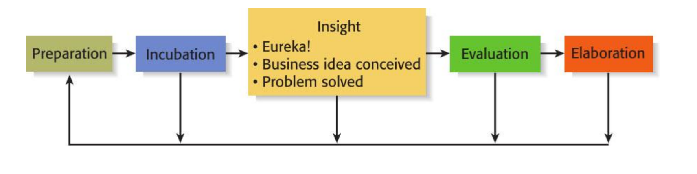

- Five Steps to Generating Creative Ideas
	- {:height 135, :width 504}
- Techniques for Generating Ideas
	- Brainstorming (No criticism, freewheeling, quick, leap-frogging(copy))
	- Focus Groups (follow up to brainstorm done by expert on topic)
	- Library and Internet Research
- ### Feasibility Analysis
	- Product/Service Feasibility
		- Product/service desirability
		- Product/service demand
		- Outcome: Market Demand Analysis, Competitive Landscape, Product/Service _Differentiation_, Customer Needs and Pain Points, Regulatory and Legal Considerations.
	- Industry/Target Market Feasibility
		- Industry attractiveness: Market Growth Potential, Barriers to Entry, Pricing Power, Intensity of Competition
		- Target market attractiveness
	- Organizational Feasibility
		- Management prowess
		- Resource sufficiency
	- Financial Feasibility
		- Total start-up cash needed
		- Financial performance of similar businesses
		- Overall financial attractiveness of the proposed venture
	-