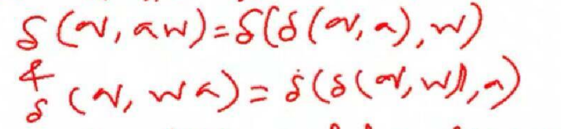
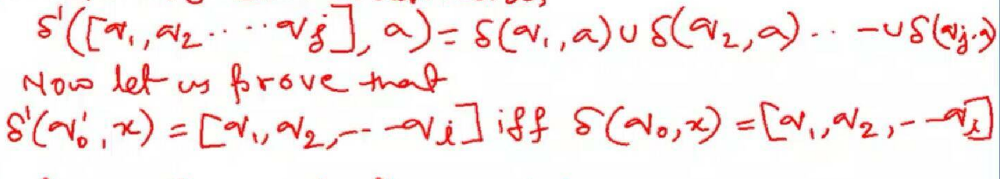
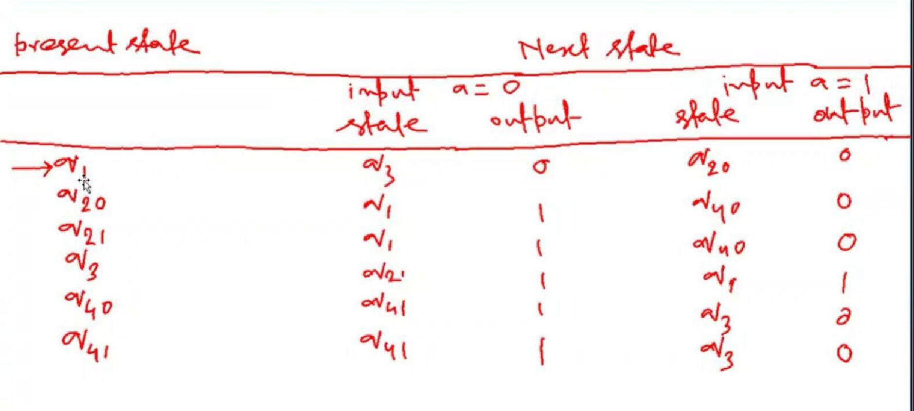
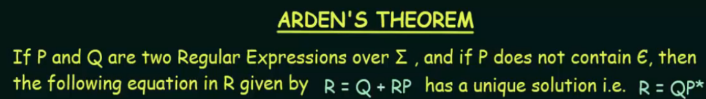

### Transition Function Properties
	- 
- ## Proof by Mathematical Induction / Contradiction
	- {:height 148, :width 778}
	- 
	- 
	- simplification of cfg = removal of non-terminal grp, removal of unreachable prod
- simple grammar aXYZ